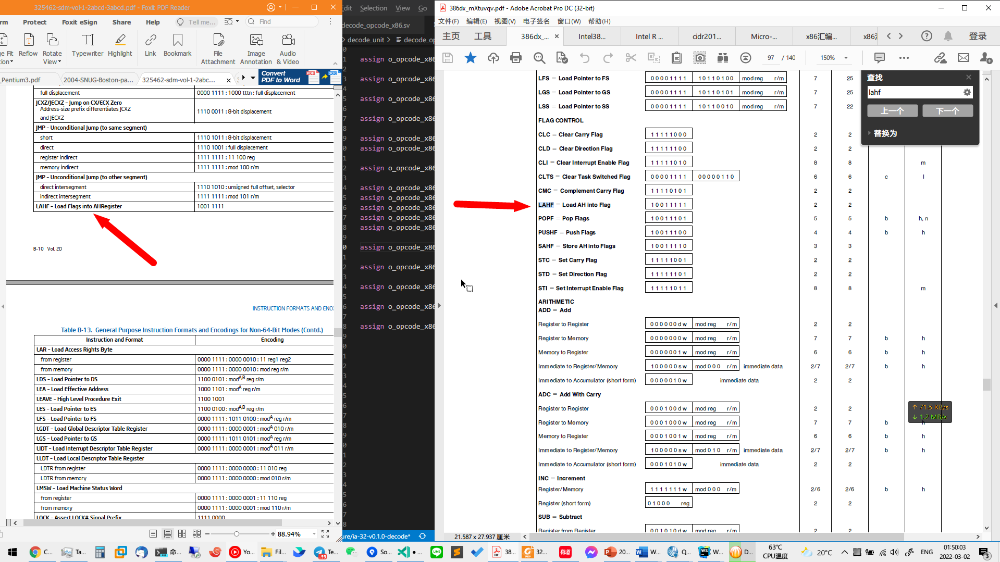
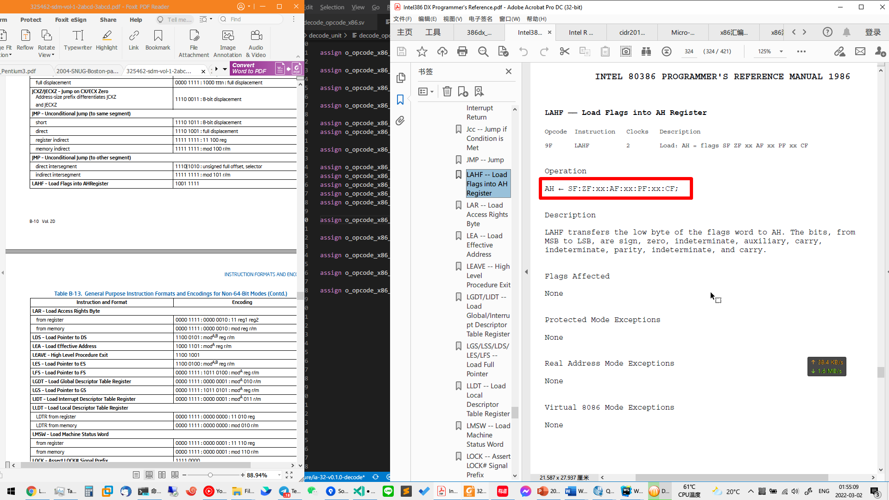
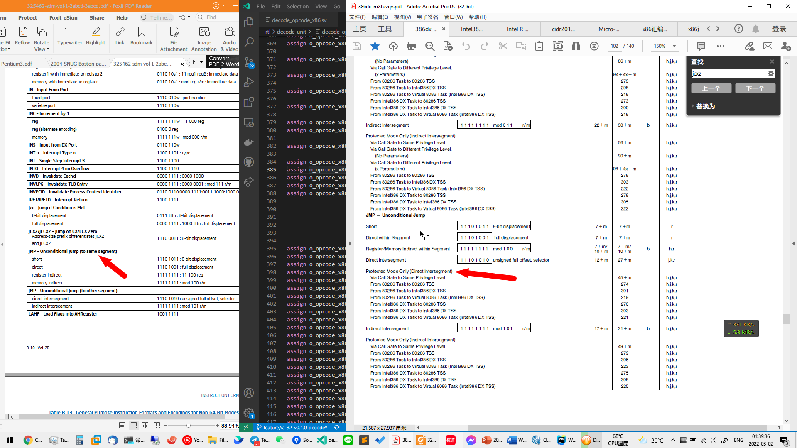
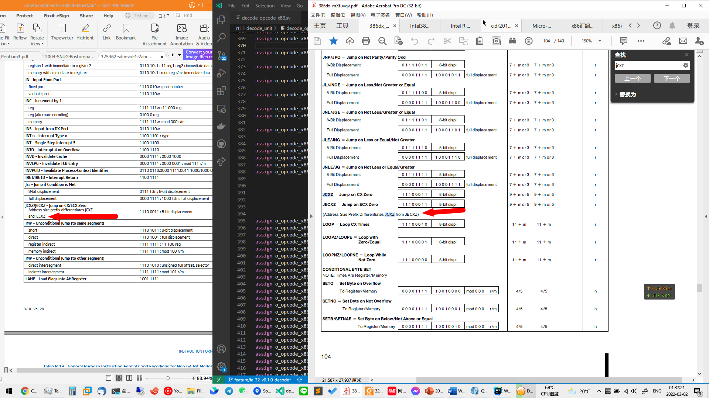

# Intel 开发者文档中一些修订细节

LAHF 指令在最新版 [Intel® 64 and IA-32 Architectures Software Developer Manuals](https://link.zhihu.com/?target=https%3A//www.intel.com/content/www/us/en/developer/articles/technical/intel-sdm.html) 的解释为: 将 FLAGS 标志位寄存器载入 AH 累加寄存器的高 8-bit 位, 但是在 Intel 80386 Datasheet 中的解释为将 AH 累加寄存器的高 8-bit 位载入 FLAGS 标志位寄存器, 我再次查证 Intel 80386DX Programmer's Reference 后从 LAHF 的operation 描述中确认最新版 load flags into AH register 为正确描述, 这是旧版 Intel 80386 datasheet 的一个错误

within segment 和 intersegment, 后者容易引起误解, inter 会被人误解为段内, 即 the same segment, 新版本文档中 Intel 改用 same 和 other 区分

描述 JCXZ 和 JECXZ 指令的区别时, 从 differentiates...from 改为 and, 我见得比较多的是different...from, differentiates 这个词还是第一次见

