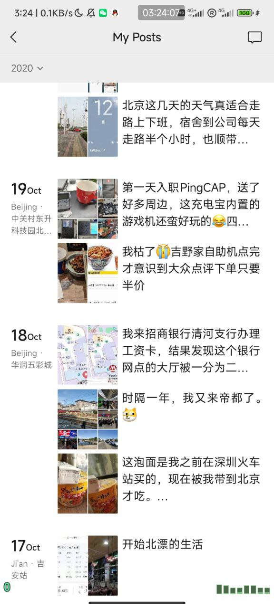

> 离职之后准备写一些随笔文章，放在 Gossip 这个分类下面，记录一些不太希望直接在 Twitter 等公开社交平台上发表的内容。
> 如果你会深挖到这里，可能你是一位对我比较感兴趣的朋友。谢谢你的关注，如果有什么话题想要聊聊也欢迎寄 Email 或者 Twitter 等私信联系我。

# 关于我的第一份实习工作

由于公司组织架构调整，我们组已经没有实习HC和转正机会了，于是从 4 月份开始，我正式结束了我的第一份实习工作。

想写一些文字纪念一下这段难忘的时光。

----

今天起床的时候因为电脑出了一些问题于是重启，重启成功进入桌面后习惯性地打开了飞书，然后弹出了登录画面，我才想起来原来我的实习工作已经结束了。

从 2020 年 10 月份入职，一直到 2024 年 3 月，不知不觉我居然在公司已经工作了近四年，可能比很多正式员工还要更老。

离职前才发现公司飞书新增显示工号，应该是按照入职顺序编码的，我是第 260 号员工。

不知道为什么，从我高中毕业之后我就一直在幻想自己的第一份工作和第一位伴侣是谁。因为前者是将要陪伴我一天 8 小时（或许更多）的环境，
后者是将要一天陪伴我剩下 16 小时的人。

我的第一份工作，或者初恋，可能会让我刻骨铭心。现在看来确实如此。因为我能把刚去实习那段时间的时光全部回忆起来，像是在昨天发生的一样。

我完全能够记得周末第一次坐火车来到北京，从火车站坐地铁到林萃桥站，在黑泉路上拍了几张照片，
并且发在了 JJ联盟（一个我们自己的黑客信安人的小圈子微信群），告诉那些高中时陪伴我一起研究技术的同学“我找到工作啦！而且是在北京！”。

那天是周六，阳光明媚。
到了观景园宿舍，和外地出差的销售同事以及另外两位已经在公司实习的研究生一起吃了楼下的山西面馆，和同事聊天时说道公司宿舍附近只有这一家比较好吃。

第二天是周日，公司 HR 告知我提前去办理招商银行的工资卡，我还担心会不会关门，没想到周末银行还是在上班。
记得按照百度地图走了很久的路去清河的招商银行支行办卡，发现【第四范式】就在旁边。

晚上提前去公司所在的东升科技园北领地附近逛了逛，提前踩点熟悉一下地形，也算是我每次在外地时的一个习惯。
（可能因为我是特工片迷，看多了 007、碟中谍 之类的电影）

我记得接手的第一个项目就是公司最旧的中文官网项目，当天之前的同事给了一个 PR，有较多 commit，请我帮忙 review 确认是否有问题。
由于 README.md 似乎对于项目依赖和环境描述不够完整，于是我和同事在不断沟通后终于能成功把项目在本地跑起来，然后顺利 merge PR。

随后的时间也在不断地学习各种平时自己做独立 side-project 项目或者接外包单时候没有接触到的技术，
例如 CI，Docker，以及一些 SSR 框架和 无头 CMS 框架等，那段时间自己学到了很多运维和开源前端系统的用法。

由于公司的前端技术栈清一色都是 React，所以下班时自己也在尝试着熟悉 React 的渲染原理后自己手写了一个简易版的 react，
这也就是 [ez-react](https://github.com/cw1997/ez-react) 这个项目的起源。

在之后的几年工作中也陆续成长了很多。尤其是大概在 2021 年左右，公司入职了一位资历很老的前端兼职和一位在北美某UC系分校的远程实习的本科生，
我们共同负责开发 https://tidb.net 这个 TiDB 开发者社区官网的项目。

这个仓库的第一行代码就是我写的。然后经过不断迭代，最后变成了现在的 https://tidb.net

由于时区关系，我们每天都约定一个晚上的时间 meeting 沟通，用 Jira 分配好任务后，大家各自在自己的工作时间把任务做好，
然后第二天晚上再继续 meeting 沟通，会议中会 review 之前写的代码，以及提前预告后续任务，讲解分析需求，补充完善 Jira 内容和更新进度，
那段时间的工作非常充实，跟着各位资深工程师也学到了很多新技术，
包括我现在做别的项目时一直在用的 SWR(Vercel 开发的 useSWR hook) 和 i18next（虽然最后砍掉了这个多语言国际化需求），

总体来说我的第一份工作令我印象非常深刻，并且都是非常正面的印象。

入职之前其实就有了解 PingCAP 的工程师文化，最早以前听到这间公司还是因为 ice1000（千里冰封） 的实习经历博文，
了解到公司在做开源数据库的宏伟目标。

入职之后也确实发现公司处处充满着工程师文化。即使是在团建路上都有人在讨论技术问题。
每天晚上也都有定期的论文跟读会议，公司图书角也有很多有意思的书，虽然我一本都没看过。（主要是因为平时自己看博客等技术文章比较多）

# 小故事

刚到公司的时候其实已经算是到发薪日了。所以我领的第一份工资刚好只有一两天左右的薪水，并且当时财务还弄错了银行卡号，导致入账失败，
最后和财务联系后妥善解决。

入职后没多久就是 10 月 24 号程序员节，所以有幸参加了入职之后的第一场团建，在呷哺呷哺吃火锅。

入职后没多久就是月底 10 月 31 号，也是公司每月底定期举办的生日会，刚好我就是 10 月 6 日的生日，有幸赶上。

来公司参加的第一场户外游玩的正式团建好像是去怀柔还是哪里打鼓，氛围比较尴尬，被 Twitter 网友说是【阴间团建】，
以至于后面行政小姐姐征求团建意愿的时候大家都在回复“只要不是打鼓就行”。

随着经济形势和融资环境的变差，确实能肉眼感受到公司福利的缩减下降，公司内部邮箱也到过全员信说明。
不过这也不能说是公司的问题，毕竟整个大环境都如此，我们作为普通工人，也只能默默理解。
记得离职的最后一天和同事聊天时谈到这件事情，我说我能理解公司的困境，同事还说“你居然为资本家说话”，
我当时回复她说“我只是希望中国那些充满工程师文化，Work Life Balance 的公司不要倒闭，留下来给大家做个灯塔”。

# 北漂生活

2023 年 10 月因为跟随者广东那边的一个台湾青年组织参加前往北京的参访活动，因此也有抽出一天时间去公司看看。
以前每天晚上下班甚至是周末不想点外卖的似乎我都会去吃公司园区的川筷子面馆，没想到过了三年，那间面馆还在，
我又进去点了一碗熟悉的鸡肉汤面，还是熟悉的味道，还是一样的好吃。一个人坐在面馆的时候，三年前刚来北京时吃饭的日子在脑海中回想，历历在目。

北京周末的技术相关线下沙龙、聚会、meetup非常多，能了解到各种前沿技术。
在之前某次活动中还和 36kr 的高管们一起吃饭聊了一些他们正在做的内部项目。
也有北京这边的出版社看到我很喜欢在知乎分享技术文章，愿意找我聊聊写作意愿。

感觉北京还是一个技术和创新氛围非常浓厚的地方，虽然走在长安街因为停留太久被警察吼过，虽然在南锣鼓巷看到满地都是垃圾到处都是骗观光客的小店，
虽然也有遇到类似于“正黄旗”等充满优越感和自我意识的本地人，
但是整体感觉北京仍然是一个技术和创新氛围很浓厚的地方，也是很多理想主义者梦开始的地方。

# 写给自己
其实当时也收获了几个其他公司的 offer，也在考虑是否要选择上市公司还是选择创业公司，
最后还是选择了 PingCAP 这间仍在融资阶段的“小小的创业公司”。很庆幸自己的第一份工作没有让我失望。

这个一天陪伴我 8 小时的工作让我记忆深刻&收获良多，希望我也能赶快遇见那个能让我刻骨铭心的陪伴我剩余 16 小时的伴侣，
希望 TA 也能像第一份实习工作那样给我留下美好的回忆，让我也能记忆深刻&收获良多。
