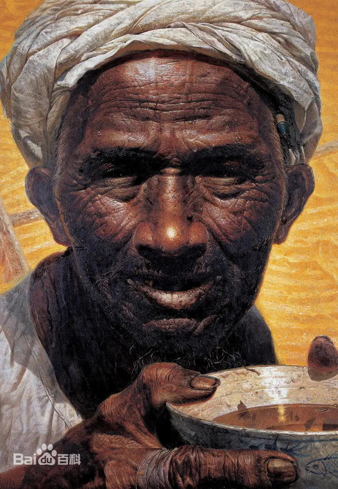

> 题记：艺术的动人之处在于创作者能够引发欣赏者的共情与思考，向读者传递能够慰藉心灵的情绪价值。
> 
> 冷冰冰的机器缺乏普通人具有的生平经历，不具有自己的独立思想，因此无法替代活生生的人类来给予我们共情的能力。
> 这也是 AI 永远无法取代人类的关键因素。

# 当我们排斥AI创作的内容时，我们究竟在排斥什么？

2023年无疑是“生成式AI（Generative AI）”的发展元年。在这一年，包括 OpenAI 和 Microsoft 等在内的公司都纷纷推出了自己的“生成式AI工具”，
例如 ChatGPT，Midjourney，Stable Diffusion 等等。ChatGPT 本质上是一个可以理解人类自然语言的对话机器人，但是通过与该机器人对话，
说明你想要创作内容的需求之后，机器人可以自动产生相关内容，所以这里也认为它是一种生成式 AI 工具。

目前生成式 AI 的用途主要有如下几种
* 翻译
* 快速从海量文本中整理出重点摘要
* 创作文章（ChatGPT，etc.）
* 创作图片（Midjourney，Stable Diffusion，etc.）
* 创作视频（Sora，etc.）
* 创作代码（GitHub Copilot）

这里面尤其是像 Midjourney、Stable Diffusion 和 Sora 的表现非常惊艳，Demo 一经发布后后爆火全网。

**但是这也引发了很多人的思考和排斥：为什么我，以及有一些人会和我一样排斥 AI 创作的内容？**

大家目前排斥生成式 AI 内容的主要原因大概有
* 内容不准确，一本正经的胡说八道
* 用于训练生成式 AI 的内容涉嫌侵权，导致生成式 AI 产生的内容可能包含有未经授权的内容。
* 创作的艺术作品，例如图片和视频本身有渲染 BUG。其实这本质上也和第一种情况相似。

但是这些都只是表象，**更深层的原因主要在于一件艺术作品的价值和内涵不仅仅在于这件艺术品本身，
而是在于这件艺术品在创作当下的时代背景，创作动机，作者的生平经历和创作起因。**
这里所说的“艺术品本身”对于一幅画来说，就是这幅画纸本身，对于一首歌来说就是歌曲的旋律本身，对于一段视频来说就是这个视频的一系列图像。
而 AI 能创作的仅仅只有**艺术品内容本身**。
从本质上来看，AI 创作的一幅分辨率为 1920px * 1080px 的画作只不过就是 1920*1080=2073600 个带有颜色的像素点而已。
**它没有自己的生平经历，没有自己的思想，没有时代背景。**
如果非要较真来看，AI 的生平经历、思想和时代背景依赖于它本身的训练样本，但是**训练样本是混合了全球各种人类创作的作品**，
他的思想是一种大杂烩，而非独立的思想。

很多出生自中国大陆的朋友可能都看过一副著名的画作《父亲》，由罗中立创作，如下图所示。

在百度百科[1]我们可以看到这幅作品的创作背景，主要想要传达的思想主题，
以及创作手法等等。

> 《父亲》是1980年罗中立根据在大巴山生活的体验，以及与农民结下的深情，创作的作品。
> 
> 20世纪70—80年代，社会处于变革时代，人们的价值观念发生了极大的变化，主体意识开始觉醒，艺术的表现意识深化，这就形成了一个良好的客观的环境。反映在艺术创作上，艺术家开始对周围身边的琐事及普通人民产生浓厚的兴趣，从而改变了以革命领袖为主要描绘对象的创作方法，《父亲》就是在这样一个良好的氛围下应运而生的。
> 
> 《父亲》原型之一是罗中立在重庆沙坪坝的公厕旁见到的一位“守粪的农民”，另一位是他在上世纪60年代去大巴山下乡时寄住的房主邓开选。两个农民的形象，奠定了《父亲》最初的样貌。
> 
> 《父亲》中的艺术形象来源于一位名叫邓开选的普通农民。20世纪70年代农民进城主要是淘粪，把粪作肥料。为了这个肥料，生产队、公社之间经常发生争斗，就是为了这个肥料，画家附近的厕所里都有农民住在里面，那时候城里面每一个厕所都有农民住在里面。农民过年的时候也守在那个地方，所以农民的那个神态和姿势，引起作者很大的震动，之后，他就画了守粪的农民，又画了一个当巴山老赤卫队员的农民，最后才有了现在这幅作品，开始画的名字是“粒粒皆辛苦”，后改成《我的父亲》，最后去掉了“我的”二字更名为《父亲》。

这幅画作一眼看去，只有一个皮肤黝黑的中年人端着一个碗，内容朴实单调。
但是当我们在欣赏这幅画作的时候不会只是看作品本身，而是一定会开始思考这个人到底经历了什么，为什么画作中的人看上去会如此苍老，
他的牙齿似乎也有缺失。
为什么他要端着一个碗，他的手上怎么还有包扎，他的手又发生了什么事情？

进而我们会想要去了解这幅作品是在什么情况下被作者所创作出来的？作者想要通过它表达什么？

如果更进一步去了解作品主题，会看到如下内容

> 《父亲》被视为伤痕画派的一个重要代表，是一幅典型的乡土写实主义作品，表现了画家罗中立的乡土主义情怀，是罗中立本人对本土文化和艺术的坚守与挑战，也是为落后的农村及农民代言，让人们关注农民，关注那朴质的美与勤劳的品格。
> 
> 作者深谙农民的困苦，懂得农民的欢乐，更理解农民的需求。《父亲》能够激起人们对于普通农民由衷的热爱、赞美和强烈的责任感，激起人们发自内心的感情波澜，而不只是一声悲天悯人的长叹。艺术融铸入人们的思想感情之中，深刻地表现出中国农民的力量和希望。命运给予他为土地的兴衰而抗争的责任，命运同时也给予他为家庭的成败而打拼的勤奋，命运给予父亲善良的心，纯朴的情，与世无争的信念，在阳光下晒得那么自然黝黑的皮肤。即使这一生没有受教育的机会，也从未有一声嗟怨，只要看到那秋日阳光下大片大片的金黄，微笑就一年一度地涌上心田。当人们凝视一个阳光下的慈父时，它的意义已不仅限于农民的力量所在，人们应该清楚地认识到它已经涉及了人类灵魂的象征。

所以可见，一副艺术作品，它的核心内容不仅仅是作品的构图和配色本身，而是作品背后所蕴含的故事，以及作者想要传达的思想精神。
尤其是对于像《父亲》这类现实主义（Réalisme）作品，他背后所蕴含的故事和精神思想甚至要远大于画作本身。

而 AI，仅仅只能创作作品本身，AI 是无法产生自己的作画动机，AI 无法表达自己想要传递给读者的思想精神，
原因在于 AI 没有自己的生活经历，所以他也无法观察身边人的生活来产生创作动机；
AI 不具有人类的情感，因此他在创作时无法与人类共情，无法体验“人间疾苦”与“七情六欲”，也就无法通过感情经历来产生自己的思想精神。

而现在无论是电影还是艺术画作，还是歌曲，恰恰就是作者与观众进行共情的重要手段，作者通过媒体创作与读者共情来达到为读者提供情绪价值的目的。

冷冰冰的 AI 机器所创做出来的内容缺乏了最核心的内涵思想之后，只有空洞的内容本身，所以我们会觉得 AI 创作的东西没有灵魂，也就失去了它的价值。

## 优秀的人类与糟糕的机器
当我们夸一个人的时候，通常会说“这个人很有自己的想法”，“这个人会坚持自我，不会一味地学习模仿他人”，“这个人有具有独立思考能力”，
“这个人很会观察生活”， “这个人是从基层出来的，很接地气”。

那么反过来，我们也可以推断出 AI 为什么会被人为是糟糕的“人类”而非优秀的“机器”，因为 AI 不具有自己的独立想法，
它的想法来源于混合了无数人的创作，这些混合思想很难形成普通人认可的价值观，因此也就无法与普通人共情，或者带给观众积极向上的心灵慰藉，
因此也就无法提供情绪价值给观众，观众也就不会喜欢这样的作品和“机器人”。

## 绝对的精准与可原谅的容错
我小学时曾经有学过两年左右的素描画。在画素描画时有一个最基本的技能就是“排线”也就是手绘直线，需要将笔握持在一个特殊的姿势，通过上下摆动手臂来绘制直线。
但是趁老师不注意我总是会偷偷用尺子画直线，但是老师看到后会很不高兴，虽然老师没有问过我原因，
但是我大概知道原因是在于素描本身就是手绘，手绘就应该是具有部分随机化的因素在里面，如果真的要强调绝对的直线，那直接用电脑进行数字作画就好了。

读研究生之后我也有开始自学钢琴，在弹钢琴时评判一个人演奏是否优秀主要也体现在是否对于强弱，节奏的快慢控制得当。
如果真的要达到节拍快慢的绝对的精准，那么现在 MIDI 自动放歌早就可以做到，完全没必要人去演奏，但是我们听 MIDI 演奏会觉得非常的机械死板，
原因就在于电脑是没有自己的情感，无法得知这首歌曲的创作背景，每个小节中作者想要表达的思想是什么，因此无法根据感情来控制强弱与快慢。
之所以现在还需要人类演奏，就是因为人类可以更加有效地表达情感。

## 美国好莱坞编剧集体罢工
2023年5月2日，美国好莱坞编剧集体罢工，要求提高薪资、公平合约、拒绝给AI打工，
这是自2007年以来，美国娱乐业首次出现的大规模罢工，也是当下科技与人类劳动力的交叉点所引发的一次重要事件。
编剧是电影和电视剧的灵魂，随着 AI 技术的发展，人类的创造性工作是否会被 AI 取代，这是一个值得探讨的话题。[2]

对于这个新闻，我的观点还是如此：真正有实力的导演根本无需担心会被 AI 取代，因为一部有内涵且能够发人深省的作品，是需要作者拥有极强的表达能力，
有丰富的生活经验，对于世界上发生的各种事情有自己的思考方式。像是 Sora 创作的视频，ChatGPT 创作的剧本，缺乏一部作品最重要的灵魂，也就是
“共情能力”，因此他无法表达除了视频图像以外的内涵思想。

这让我想起了去年 Pixar 出品的那部被骂爆的动画电影《Elemental (元素方城市)》，
它给我们人类留下了更多思考：
家世背景和种族差别是否会造成阶级隔离？
我们自己的人生决定权是否要受限于原生家庭？
我们是否要为了爱情而去抛弃父母给自己的期望和产业？
观众想明白了上面的问题，让我们对自己的人生规划有了更清晰的认识，或许比这部电影本身还更重要。
如果当一个电影编剧创作出来的作品存在价值观取向与普世价值观不符的问题，导致无法让观众认可与共情，那么将会被推向历史的垃圾堆，被观众所唾弃。

同理，在中国大陆也有像《小时代》一样糟糕的影视作品，同样也是因为其中的剧情太过于浮夸，离普通人的生活太遥远，因此无法与普通人产生共情，
所以也被众人所唾弃。

AI 创作也同理，因为 AI 没有经历过跨越阶级的恋爱，没有经历过想法与自己不一致的原生家庭的生活，因此 AI 无法与人类共情，
也就无法创作出被人们所喜爱和认同的经典作品。那么 AI 创作的电影也会和《Elemental (元素方城市)》一样饱受差评而不被观众喜欢。

所以真正有实力的编剧根本无需担心自己被 AI 取代，因为人类的生平经历所带给自己的真实思想是无法被冷冰冰的机器所模拟的。

最后给大家推荐一个我认为写德很好的知乎问答： 
> 将一幅抽象画给美院老师看，他能迅速看出是大师水平的还是随便瞎画的吗？是如何看出来的？ - 白箱的回答 - 知乎
https://www.zhihu.com/question/314754694/answer/1680866078

能够有效解释艺术究竟是什么，艺术应该要表达什么，如何去正确的欣赏艺术，以及对于艺术的祛魅化。理解这些之后，
也能更好地理解 AI 创作的艺术和人类所创作的艺术最大的区别是什么，以及为什么 AI 创作的艺术并不是真正的艺术。

# Reference

1. 父亲 罗中立创作油画作品 - 百度百科 https://baike.baidu.com/item/%E7%88%B6%E4%BA%B2/1465141
1. AI救不了好莱坞，16万演员联合编剧上演史诗级「罢工大戏」 - 36kr https://36kr.com/p/2349674407631365
