# 从零开始写一个操作系统（一） —— 基本概念

随着科技发展，我们每天都离不开各种智能化电子产品，在这些产品上跑着各种操作系统（OS，Operating System），例如手机上有 Android 、 iOS，电脑上有 Windows ，macOS ，还有各种 Linux 发行版。除了手机和电脑以外，其实我们身边还有很多白色家电，他们也都跑着一些嵌入式操作系统，例如中国大陆的 RT-Thread，国外的 μC/OS-II 等。还有一些对时间精度和响应速度要求极高的场合，例如工厂流水线，汽车控制器，火星月球探测器等地方，还会使用 FreeRTOS 等实时控制操作系统。

这些操作系统都是怎么开发出来的？CPU又是怎么配合这些操作系统运行我们人类指派给他的任务？在《从零开始写一个操作系统》这个系列中我会用最少的代码解释清楚这些问题。

软件部分我会以我自己写的 ez-rtos 这个项目作为讲解案例，这个项目使用C语言和ARM汇编语言开发，因此你需要有这两门语言的基础。整个编译环境为 Keil 5，因此你需要安装好Keil 5 并且安装 STM32 相关的 pack。

案例项目地址： [https://github.com/cw1997/ez-rtos](https://github.com/cw1997/ez-rtos)

硬件部分我会用 STM32 单片机作为 CPU ，你可以花点小钱（大概三百人民币以内）在某宝上购买一块 STM32 开发板亲自做一下这个操作系统的实验加深理解。当然你也可以直接在 Keil 这个软件中跑仿真来验证自己的实验结果。不过我觉得能够让自己写出来的操作系统看得见摸得着，花点小钱买个开发板还是很值得的，毕竟这样还可以把学习成果分享给身边的人，很 cooooooool 不是吗 →_→。

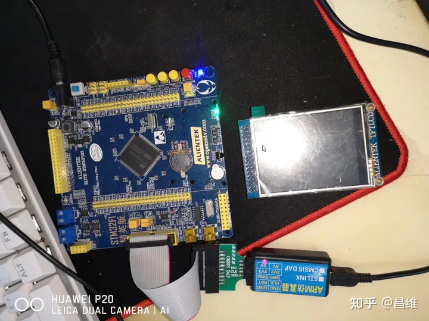

型号方面我目前用的是 `STM32F103ZET6` 这款单片机芯片，这个型号的 Flash （存放你写的操作系统代码的存储器，你可以理解为电脑中的硬盘）是较大的一款，除了学校教育用途以外，在工业界用的也很多，性价比也很合适，除了不能联网和蓝牙以外，各种外设功能也都很齐全，作为学生来说非常适合。你只要确保你买到的 STM32 开发板的芯片型号开头部分是 STM32F103 就好，后面的 ZET6 的区别仅仅体现在内存容量，工作温度等，对我们学习 OS 本身影响不是很大。

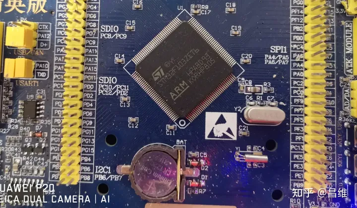

## 前置知识

了解操作系统的开发之前，你需要预先学习大学本科的《计算机组成原理》这门课程。因为操作系统作为一个直接和 CPU 打交道的软件，你必须要了解 CPU 基本的工作原理以及周边配件（内存，硬盘，显卡，声卡，网卡等）是怎么和 CPU 交互的，在这些交互过程中 CPU 又会有什么样的行为，这些行为细节对于我们操作系统的正确运行至关重要。

你还需要对任意一个指令集的汇编语言有所了解（只需要了解有哪些汇编助记符，他们能做什么事情就好，对于他们的行为细节不需要非常精通），还需要学习一下C语言，了解C语言中的指针，数组，结构体等概念。因为这些概念在我们要写的操作系统中都会涉及到。

当然这些知识的熟悉程度只需要达到基本了解即可，不需要精通。这里怎么判断我对某门课程是基本了解呢？我分享一下我的技巧：如果我提到这门课的某一个知识点，你能快速想到这个知识点自己曾经有学过，并且知道这个知识点在教科书或者经典著作的哪个部分提到过，又或者你知道搜索哪个关键词可以快速重温这个知识点。对于一门课程里面60%到80%的知识点，你能做到上述行为，说明你已经有基本了解了，如果能到80%-100%那说明你已经非常熟悉了。

如果你不是计算机科学或者电子工程相关的科班学生，可能没有修过《计算机组成原理》或者《汇编语言》相关课程，因此我推荐你可以先看看《编码》

[编码 (豆瓣)](https://github.com/cw1997/ez-rtos)

先对信息，数字电路这些概念有基本认识。

或者你甚至高中不是学的理科，而是文科，完全没学过高中物理，那也不用惧怕。因为高中物理电学中学的电磁场，电容器等知识在我们这里并不会涉及到，你可以放心大胆的学。

看完上面这本书之后，你还可以去中国大学MOOC等慕课平台上看看计算机组成原理相关的课程稍作了解。（平心而论，我看过中国大学MOOC上面几个计组的课都是照着PPT念，如果你觉得看不下去也可以不用仔细看，囫囵吞枣的看，知道有哪些概念就好了，我后面还会做补充）

如果你已经学过上面提到的那些知识，那就可以直接进入下面的学习了。

## 基本概念

### CPU
大家都知道是中央处理器，它可以按顺序执行硬盘或者 Flash 闪存中存储的程序指令。

### 指令集
这些程序都是一些 0101 的数字，这些数字对应某一款 CPU 的指令集机器码。例如 Intel 的 CPU ，基础指令集都是 X86，手机上的CPU，例如高通骁龙的基础指令集是 ARM

但是基础指令集是一个很宽泛的概念，实际上电脑的CPU还有扩展指令集，例如AMD率先推出了64位CPU，这里64位CPU的意思是CPU可以同时处理64个bit的数据，并且对内存地址的寻址也可以使用64bit宽度的地址。由于硬件设计原因，操作64位数据和操作32位数据的机器码指令其实是不一样的，因此在AMD的CPU上会有一个扩展指令集叫做 AMD64，在Intel上也有对应的64位扩展指令集叫做 EM64T。

### 指令集架构
指令集只是一系列的机器码和其对应的汇编助记符。而 CPU 除了指令集的操作码以外，还有它对应的操作数，例如寄存器就是一种操作数。不同的指令集架构中的寄存器数量，寄存器功能，特殊寄存器的总线地址并不一定都相同。

例如 ARM 指令集就有更加细微的 ARMv7，ARMv8 等指令集架构。

由于不同的指令集架构会有细微的差异，因此同样是 ARM 指令集写出来的程序，不一定能够互相移植。这也就是为什么某些搭载 ARMv7 指令集架构的手机无法升级到最新的 Android 系统或者无法使用某些针对新款 CPU 开发的 APP 的原因。

### 微架构
内地C语言考试经常会遇到类似于运算符优先级问题，例如i+++++i等于多少。这些情况由于编译器对这条语句的解读方式不一样，导致实际编译出来的结果是不同的，这就是编译器行为不同导致结果不同的典型案例。

在CPU指令中也存在类似问题，例如两款CPU都是同样的ARM指令集，但是他们执行同一个机器码指令可能对CPU中各种寄存器和栈的影响不一样。在《CSAPP》这本书中就提到过push pop这两个指令的行为定义，在某些CPU上可能是先把数据压栈或出栈然后修改栈顶指针，而在另一些CPU中则是先修改栈顶指针然后进行压栈出栈操作。又例如不同的CPU可能中断数量，支持的内存大小等等都不一样，因此指令集相同不一定能百分之百确保软件可以互相移植。

对于一款CPU，指令集只是一个设计规范，具体怎么实现这个规范，各家CPU设计厂商会有自己的实现方式。因此除了指令集以外我们还需要定义指令集本身的一些行为，把这些实现特殊行为的数字电路设计方案就称为微架构（大部分情况下厂商会把这些设计方案申请知识产权并且做成闭源的 IP Core 网表或者电路板图，例如我们通常说某某手机 SoC 的 CPU部分采用了 ARM Cortex-A73 公版方案，就是指这个 SoC 向 ARM 购买了 A73 的 IP Core）。家用电脑上的 X86 CPU 为了保证兼容性，通常不同年代生产的CPU，指令集的行为几乎都是相同的，只是每一代的扩展指令集和功耗性能等方面进一步优化，因此我们会发现在 PC 的 CPU 上做开发，通常没人会去区分某个电脑软件编译的目标平台是哪个微架构，所以为了方便起见都将家用电脑的CPU统称为X86架构。不过家用电脑 CPU 实际的微架构通常每年都会革新一次，例如 Intel 的 Nehalem，Sandy Bridge，或者 AMD 的 Zen 等等。（但是也有极少数特例，例如AMD Zen出现过缺失部分指令导致无法安装Win98的情况）

但是在手机以及嵌入式领域那就不一样了。为了压缩成本和功耗，嵌入式领域会针对不同场景推出专用的微架构。例如 ARM 有 Cortex-M 系列，Cortex-A 系列，还有针对实时控制领域的 Cortex-R 系列。手机上我们听到最多的就是 ARM Cortex-A系列了，例如A53，A73等，其中A73指的就是这款手机的CPU微架构是ARM Cortex-A73。因为微架构不一样，因此手机系统就存在兼容性问题，例如一些老旧手机就不能升级新的安卓系统。

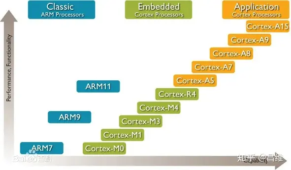

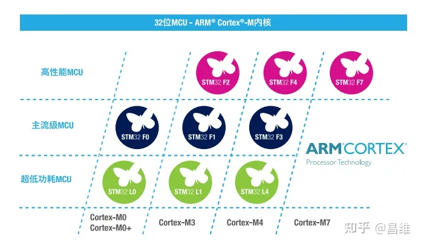

我们这里编写操作系统的CPU指令集架构为 Cortex-M3，简称CM3，请记住这个指令集架构的名称。后续我们在开发过程中会参考《Cortex-M3权威指南》这本手册，这本手册就详细描述了CM3这个指令集架构的一些行为特性，这些行为细节对于我们开发操作系统很重要。

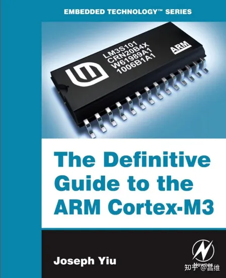

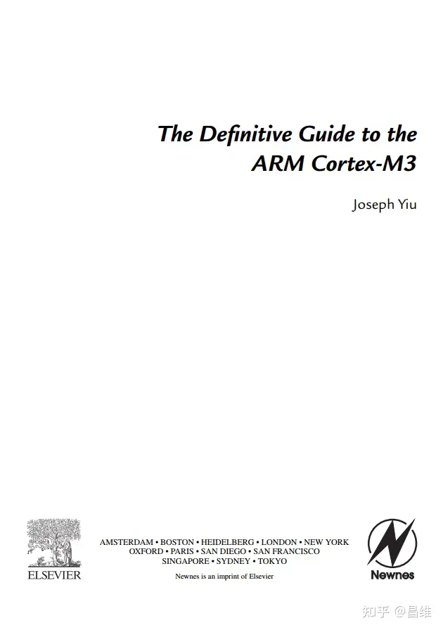

### 单片机
前面提到了 CPU 和指令集架构，他们和单片机之间是什么关系呢？我们类比家用电脑来说明。

我们家用电脑通常是CPU，内存，主板，硬盘等硬件设备组成。他们都是互相分离，由不同的厂商生产的，我们只需要把他们组装在一起接好线就能够开机运行。而单片机则是将传统电脑中互相分离的这些设备都整合在了一块芯片上，例如一块单片机芯片上就同时具有了CPU，硬盘，内存，这也就是“单片机”这个名字的由来。

例如 `STM32F103ZET6` 这款单片机芯片就集成了 Cortex-M3 的 CPU，512KB 的“硬盘”，64KB 的内存，以及带有 112 个 GPIO 接口的“主板”

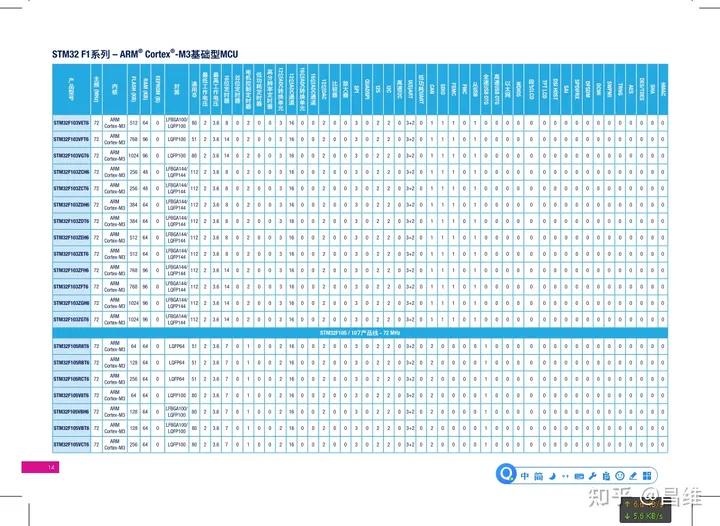

其实 STM32 的芯片型号有很明显的规律，可以在 ST 官网的芯片选型手册中查看到。

我这里有一张 2016 年的选型手册的截图可以给大家参考

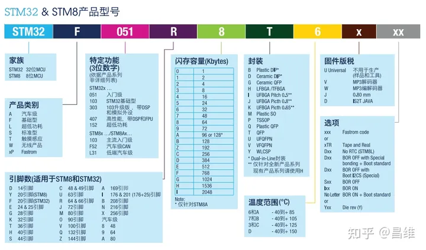

### 外设
提到外设，我们可能会想到，打游戏需要很好的鼠标键盘耳机，这些是家用电脑的外设。到了嵌入式领域，这些外设则是下图中提到的定时器，USART，USB，SD卡等集成在单片机内部的外设。这些外设可以方便我们做嵌入式开发，也可以方便我们CPU和外界交换数据。

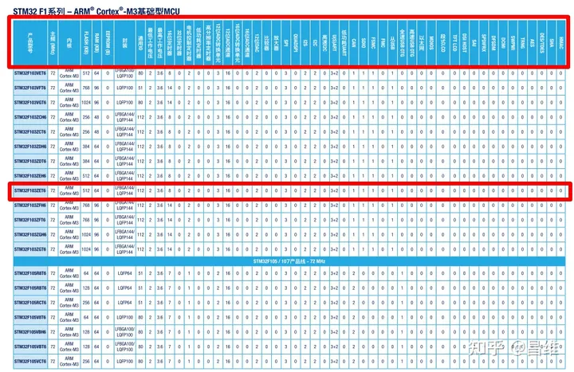

## 准备环境
首先你需要正确安装好 Keil 5 以及 STM32F1 系列的 pack，具体环境配置请自行使用搜索引擎。配置好以后，你在创建项目的时候应该可以看到如下的 device 可供选择。

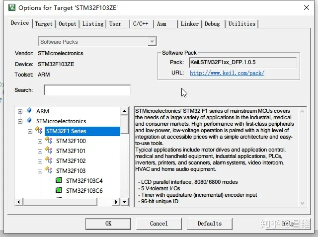

然后你可以在 github 下载本教程相关的所有源代码，地址如下

如果你是将该 repo fork到你自己的仓库，那么你还需要加入 upstream 的 remote 源，因为现阶段代码仍然有一些 BUG，我可能会不定时修复，因此你可以不定时看看 upstream 是否有新的 commit 可以 pull。因此我也建议你点击 github 右上角的 watch 按钮订阅并实时跟进我最新的修改，以防出现 BUG 后影响你的学习。（PS：都点了 watch 了，那顺带也给我点个 star 呗，→_→）

[https://github.com/cw1997/ez-rtos](https://github.com/cw1997/ez-rtos)

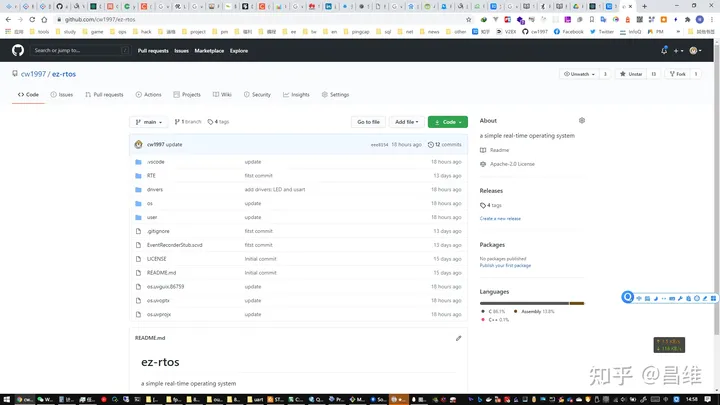

然后你还需要下载如下文档，以便后续参考。下载地址我放在图片后方

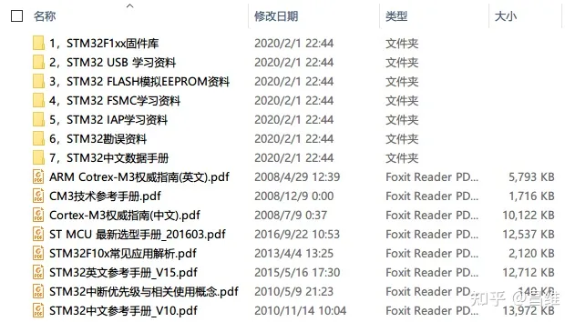

> 链接：[https://pan.baidu.com/s/10NPAMMLbcw8Yv2JSbwlduQ](https://github.com/cw1997/ez-rtos)
> 
> 提取码：1234
> 
> 复制这段内容后打开百度网盘手机App，操作更方便哦

以上准备都做好以后，打开刚刚从GitHub clone下来的项目文件夹，你会看到如下文件

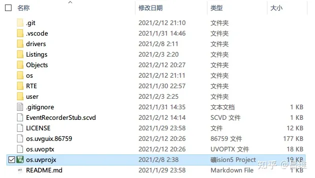

双击 os.uvprojx 打开它，你应该能看到如下界面

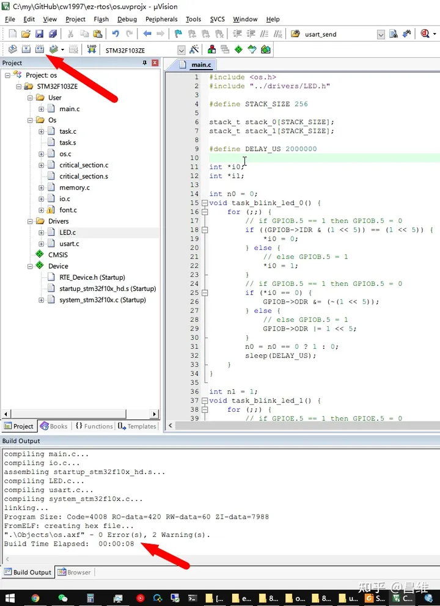

点击红色箭头所指向的 Build 按钮后，如果你看到下面显示 0 Error 相关的提示，说明编译成功，你的环境没有问题，否则你应该仔细观察报错详情，有针对性的解决它。（同行都是文件有遗漏或者相关的 Pack 没有安装或者 Keil 没有注册导致无法编译过大的代码）

编译通过后接下来我们还要尝试着运行一下看看是否能成功。

运行嵌入式代码有两种方式，一种是电脑仿真，也就是电脑模拟一个 STM32 的单片机，观察他的行为，还有一种方法是直接把程序下载到单片机开发板中观察行为。

这里我们选择使用模拟器仿真，所以我们按照红色箭头进行相关操作。

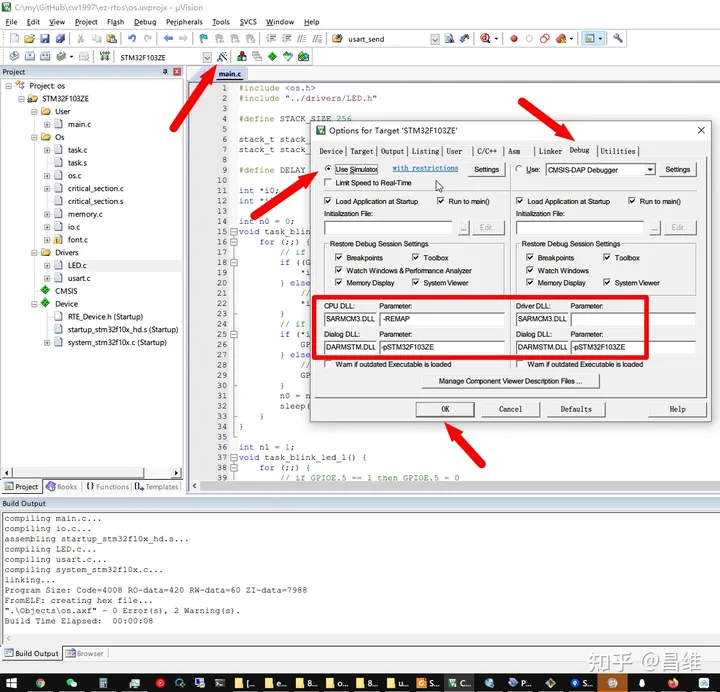

请注意红色框框中的那些参数不要打错，否则有错误后在仿真阶段不会有任何提示，但是就是无法执行。这些参数的含义是告诉 Keil 的仿真环境使用何种 CPU 的模拟器以及相关的调试器。

点击 OK 按钮以后我们再点击 Debug 按钮开始正式进入调试环境

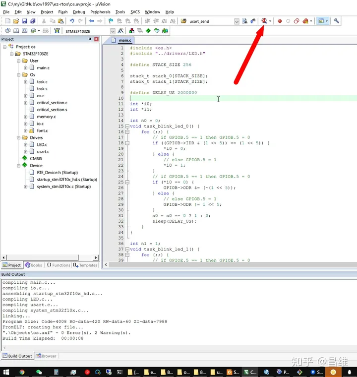

进入 Debug 的环境应该是下图所示

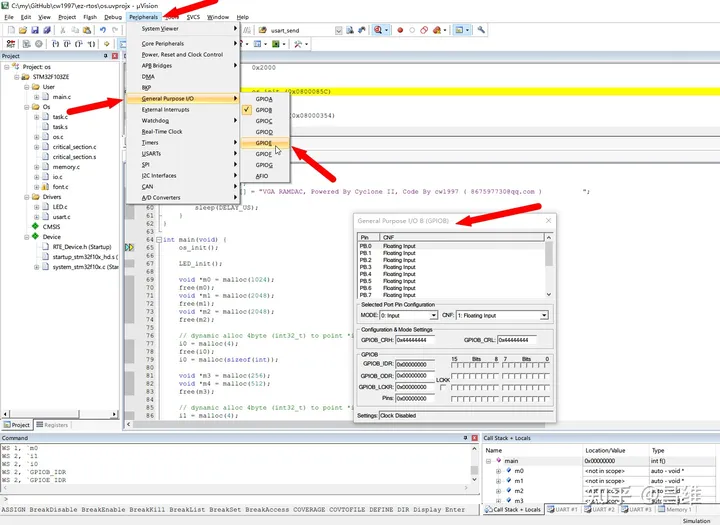

我们按照箭头所指的操作将 GPIOB 和 GPIOE 引脚的观察窗打开，这里之所以打开这两个引脚的观察窗，是因为我自己的开发板上有两个 LED 灯是在这个引脚。所以我代码中是对这两个 GPIO 接口上的引脚做高低电平的切换作业。

把调试窗口打开以后，再点击 Run 按钮则开始模拟器的全速运行了。

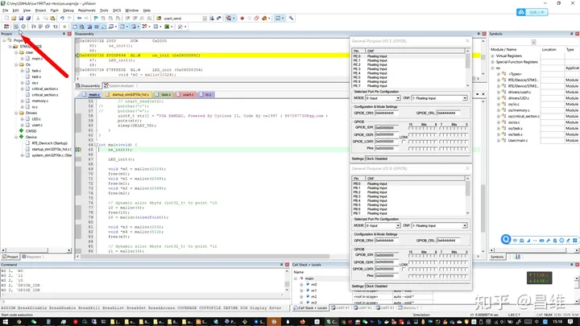

然后你应该会看到调试窗口中的这几个位置的对勾会自动不停的勾上或者取消，这些对勾代表了电平高低，勾上就是高电平，取消对勾就是低电平，对应到物理硬件上就是 LED 灯的亮和灭。

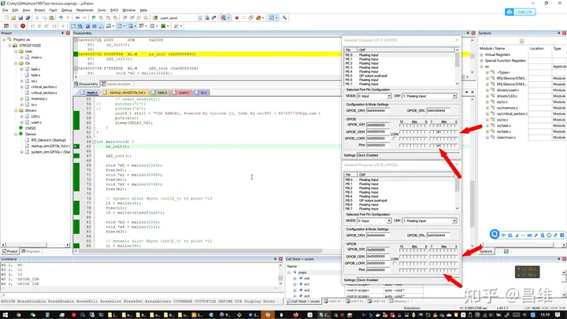

如果你能看到这个现象，那么恭喜你，你的环境配置完全正常。

为什么选择基于 Cortex-M3 的 STM32 作为开发平台？
有的同学可能只学过电脑上的编程，便会有疑惑，为什么这里选择的是在 STM32 单片机上开发操作系统，而不是普通的 X86 电脑环境呢？一是 X86 的架构比较复杂，不仅仅有 X86 本身指令集架构的复杂性，还有他周边设备的复杂性，例如你要编写操作系统最基础的 BootLoader，那么得了解 BIOS 和 UEFI 的规范（因为 BIOS 或者 UEFI 环境是整个家用电脑上电之后第一个运行的程序）。而且 X86 指令集本身属于 CISC 复杂指令集，学习曲线比较陡峭。当然如果你执意要学习 X86 下的 OS 开发，我这里推荐你一本书：《x86汇编语言:从实模式到保护模式》

这本书可以说是国内对于X86汇编，保护模式，操作系统任务切换器开发方面讲解最好的书籍了。其配套的十几个小代码片段也是非常经典的汇编程序案例。

[https://book.douban.com/subject/20492528/](https://book.douban.com/subject/20492528/)

STM32 是基于 Cortex-M3 微架构的单片机，这个微架构的规范非常简单。它有多简单呢？你看看 CM3 权威指南的中文版才不到三百页就知道它有多简单了。

当然还有更简单的 RISC-V 指令集，只不过由于目前使用它的场合还不是很多，无论是就业岗位还是学习资料仍然还没有 ARM 的 Cortex-M 系列那么多.

所以跟着人多和资源多的地方走肯定没错。

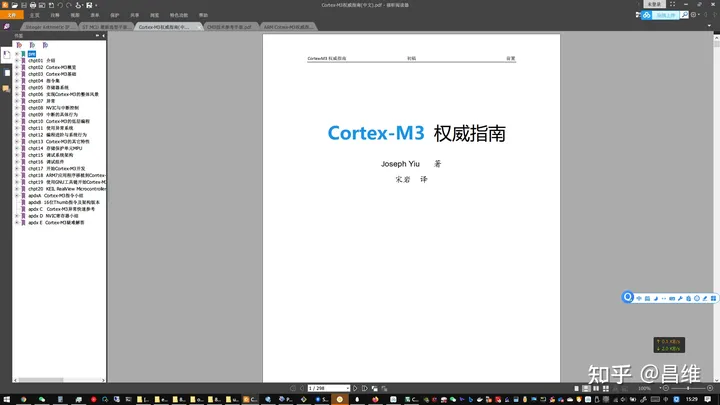

## 总结
这一章我们把学习所需的基本环境做了简单介绍，下一章就开始正式进入 OS 开发了。

我的 OS 总共支持如下 4 个功能

基于时间片的多任务轮流切换，以及支持使用 sleep() 暂停任务的执行
1. 临界区（critical section）
2. 内存管理（malloc(uint32_t size) 和 free(void *point)）
3. 文字输出（putchar(uint_8 ch) 和 puts(uint_8 *str)）
4. 因此我也会分四个部分分别讲解。
