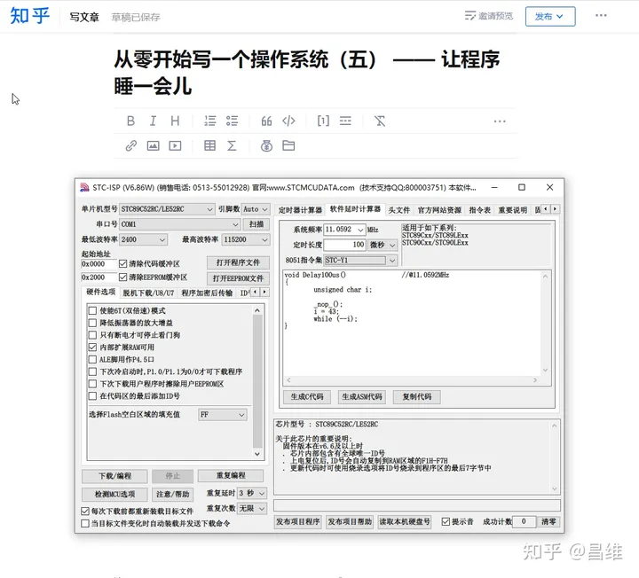
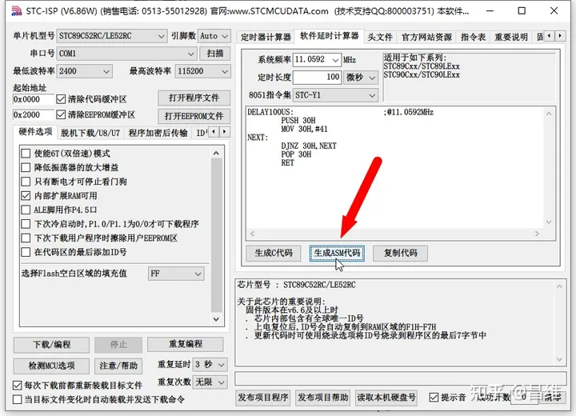
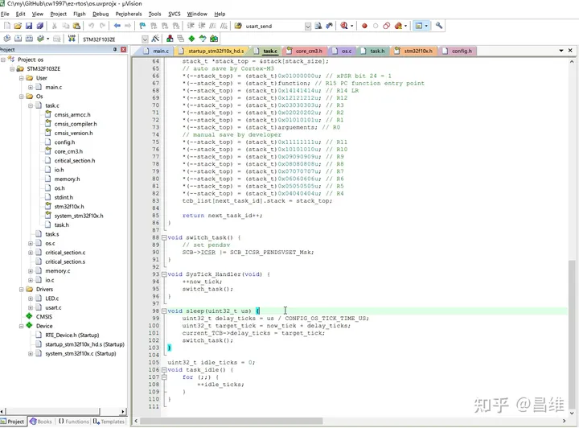
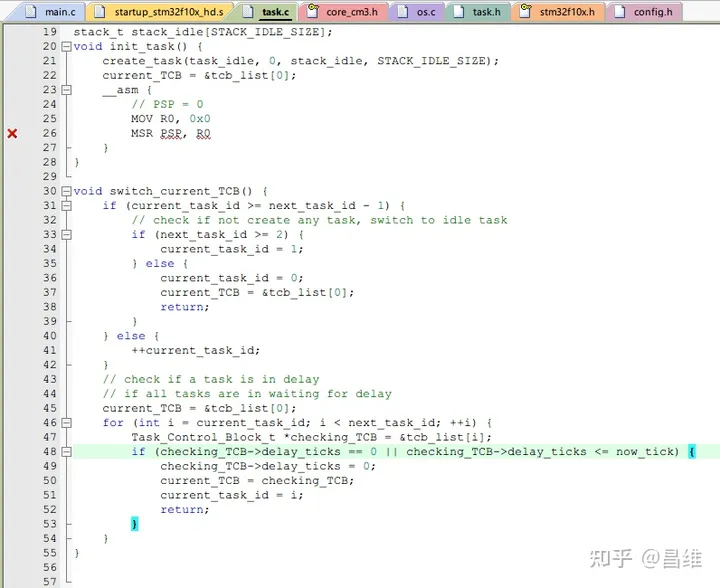
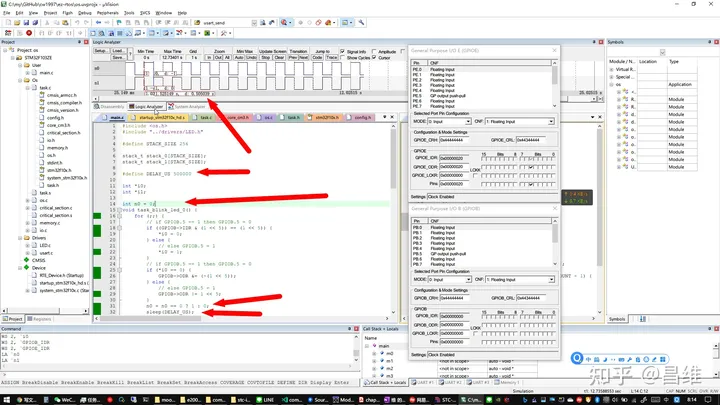

# 从零开始写一个操作系统（五） —— 让程序睡一会儿

每个学过编程的人可能都见过 sleep() 函数。它可以让程序“睡”一会儿，更专业一点来说，是让程序代码执行到某个位置后阻塞一段时间，然后接着执行 sleep() 函数后面的代码。

## sleep() 函数由谁提供
sleep() 函数在不同的语言中是由不同的包（命名空间）提供。例如在 Windows 平台的 C 语言中是由 Windows.h 提供，在 类 unix 系统平台上是由 unistd.h 提供，在 python 和 golang 中是由 time 这个包提供，在 Java 或者 C# 中是由 Thread 包（命名空间）下提供。

你有想过这个函数本身是怎么实现的吗？在没有 OS 的环境下，例如单片机和裸机环境中该怎么实现这个函数呢？这就是本篇文章的讲解重点。

## 指令执行的时间
我们在写代码的时候会写一行行的语句，这些语句会被编译器编译成一条条的机器码指令，这些指令会被 CPU 执行。每条指令执行都需要一段时间。

一条指令具体需要执行多少时间，和 CPU 底层电路设计，以及 CPU 的主频有关，CPU 的底层电路设计决定了一条指令执行需要多少个时钟 tick，而 CPU 的主频决定了每秒有多少个时钟 tick。

## 通过指令耗时实现软件延时函数
我们可以通过精确计算一条指令的执行时间，然后让这条指令重复执行一定次数，实现延时特定的时间长度。

因此在单片机或者裸机环境中，为了让一段代码等待一段时间后执行，大家能够想到最简单的办法就是用 for 语句循环指定的次数，通过 for 函数循环本身的耗时，让程序阻塞一段时间后再执行后面的代码。

事实上早期很多人写 51 单片机的时候就是用这种办法实现 sleep() 函数的。

如果大家用过 STC 的 51 单片机，那么会发现他们提供的 STC-ISP 上位机就提供了根据单片机的晶体振荡器和指令集（不同的单片机型号在指令集和执行时间上有细微差别）自动生成 sleep() 函数的工具。



## STC-ISP 上位机内置的延时代码生成器
因此很多早些年写 51 单片机的人都是直接通过这种办法生成 sleep() 函数的。

我们可以单击【生成ASM代码】按钮观察对应的汇编代码



这里其实是 51 单片机的开发商通过精确计算这段汇编代码在特定指令集下，每条指令的执行时间，再配合晶振频率以及你想要延时的事件，根据一定的算法计算 MOV 30H,#41 中的立即数（也就是#41）应该为多少。

在别的 CPU ，例如 ARM Cortex-M ，RISC-V 中，则需要查阅他们的文档获取某些指令的执行时间，然后再根据 CPU 主频来决定究竟应该使用哪些指令，循环多少次才能准确延时指定的时间长度。

由于这种延时方式为通过软件指令耗时的方式实现，因此也成为软件延时。

## 基于硬件定时器的延时函数
之前介绍过一种通过指令耗时的方式实现 sleep 函数，但是这种方法只适合在单片机裸机环境中使用，并且只适合对精度要求不高的场合。

因为之前的方式让 CPU 不断在 for 循环内执行，因此在 sleep 函数执行时，CPU 无法让出时间片执行其他的函数，此时 CPU 时间就被白白浪费了。

而且这种方法可移植性很差，因为它高度依赖 CPU 硬件设计和指令集耗时，有时即使是同一个 CPU，可能不同的修订版本都有不同的指令执行时间，一旦硬件开发者没有注意这些细节而直接将代码移植到新修订颁布的同型号 CPU 中，可能会导致程序出现难以发现的 BUG。

其实还有一个问题就是，软件延时器本身会有非常小的误差，例如通常很多人都是使用某些软件延时代码生成器生成一个 Delay100us() 函数，然后自己再去封装一个 delay_ms(uint_32 ms) ，而这个函数的实现就是先计算 ms *10（因为 1ms == 10 个 100us）也就是循环次数，然后再 for 循环上面计算的次数，而这里引入了乘法运算，引入了额外的 for 循环，引入了函数调用和返回，这些都会导致延时不够精确。

那么有什么更精确的办法呢？

那就是使用硬件定时器实现延时。硬件定时器通常叫 Timer，在 STM32 中会提供多达数十个硬件定时器，在 51 单片机中也有好几个。我们可以在 sleep 中启用硬件定时器，然后在主循环中不停判断硬件定时器的中断位寄存器是否为 1 来判断是否到达了指定的延时时间。

我们还可以更进一步优化，在延时期间让出 CPU 时间，通过把 sleep() 函数后面的代码移动到定时器的中断响应函数中，让定时结束后自动执行中断函数里面的代码，然后就可以去执行其他的代码了，后面的 CPU 时间可以完全被让出来。

但是硬件定时器本身毕竟是由硬件实现，而硬件资源的数量是有限的，所以硬件定时器本身也是有限的，当硬件定时器不够用了，我们就只能用软件延时器了。

## 在 OS 中实现 sleep 函数
OS 由于要同时执行多个任务，因此在 OS 中必须让一个任务在延时的时候，能够让出 CPU 时间片执行其他任务，实现 CPU 最大化利用。

该怎么实现呢？

我们的会想到之前讲解多任务切换器的时候提到了我们使用 SysTick 定时切换任务，并且每次 SysTick 中断响应时，对 now_tick 变量进行自增。这里我们也可以利用 now_tick 变量做一些事情。

假设任务 A 需要 sleep 1 秒钟，那么我们可以在 TCB（任务控制块，可参考前面任务切换器章节了解该数据结构）中将当前 now_tick 加上 1 秒钟的 tick 数量，也就是 1 秒后的 now_tick 值写入 TCB 中的下一次执行时间。那么每次在任务切换的时候都需要检查一下任务列表中是否有下一次执行时间大于等于 now_tick 的任务，如果有就立即切换到他，否则就按部就班切换到下一个任务，如果全部任务都小于 now_tick ，则说明全部任务都没有到达延时时间，都处于延时状态，这种没有任何任务可以执行的情况下，OS 应该切换到 idle 任务执行。

我们还要考虑一些边界条件。例如我们在每次新建任务的时候，都将 TCB 中下一次执行时间默认设为 0 ，因为 0 说明下一次执行该任务的时间应该是在 OS 刚刚启动的时候。

我们看看具体代码实现

代码在 task.c 中



```c
void sleep(uint32_t us) {
    uint32_t delay_ticks = us / CONFIG_OS_TICK_TIME_US;
    uint32_t target_tick = now_tick + delay_ticks;
    current_TCB->delay_ticks = target_tick;
    switch_task();
}
```

可以看到这里通过 us / CONFIG_OS_TICK_TIME_US 计算出需要延时的 tick 数量

再通过 target_tick = now_tick + delay_ticks 计算出延时到达时的 tick 值

然后通过 current_TCB->delay_ticks = target_tick 将延时到达时的 tick 值写入到任务列表的响应字段上

最后通过手动执行 switch_task() 发起任务切换，让任务切换器切换到其他能够执行的任务上，也就是主动让出时间片。

上面都是 sleep 函数本身的实现。

而为了配合 sleep 函数的实现，任务切换器也需要做一些小小的改进。



```c
void switch_current_TCB() {
    if (current_task_id >= next_task_id - 1) {
        // check if not create any task, switch to idle task
        if (next_task_id >= 2) {
            current_task_id = 1;
        } else {
            current_task_id = 0;
            current_TCB = &tcb_list[0];
            return;
        }
    } else {
        ++current_task_id;
    }
    // check if a task is in delay
    // if all tasks are in waiting for delay
    current_TCB = &tcb_list[0];
    for (int i = current_task_id; i < next_task_id; ++i) {
        Task_Control_Block_t *checking_TCB = &tcb_list[i];
        if (checking_TCB->delay_ticks == 0 || checking_TCB->delay_ticks <= now_tick) {
            checking_TCB->delay_ticks = 0;
            current_TCB = checking_TCB;
            current_task_id = i;
            return;
        }
    }
}
```

主要改进在 switch_current_TCB() 函数中，这里需要额外增加判断 checking_TCB->delay_ticks 是否小于等于 now_tick 的逻辑，如果小于则将当前任务指针切换到那个小于等于 now_tick 的任务，否则就切换到默认的 0 号任务也就是 idle 任务。

这就是整个 sleep 函数的实现了。



最后大家可以看看仿真环境下，我们通过 sleep 函数，分别在两个不同的 task 中设置每隔 DELAY_US（500000 us = 500 ms）翻转一次 n0 和 n1 变量 ，然后仿真观察波形变化，发现延时时间长度正确，误差也极小。

下面是测试用的 main.c 代码

```c
#include <os.h>
#include "../drivers/LED.h"

#define STACK_SIZE 256

stack_t stack_0[STACK_SIZE];
stack_t stack_1[STACK_SIZE];

#define DELAY_US 500000

int *i0;
int *i1;

int n0 = 0;
void task_blink_led_0() {
    for (;;) {
        // if GPIOB.5 == 1 then GPIOB.5 = 0
        if ((GPIOB->IDR & (1 << 5)) == (1 << 5)) {
            *i0 = 0;
        } else {
            // else GPIOB.5 = 1 
            *i0 = 1;
        }
        // if GPIOB.5 == 1 then GPIOB.5 = 0
        if (*i0 == 0) {
            GPIOB->ODR &= (~(1 << 5));
        } else {
            // else GPIOB.5 = 1 
            GPIOB->ODR |= 1 << 5;
        }
        n0 = n0 == 0 ? 1 : 0;
        sleep(DELAY_US);
    }
}

int n1 = 1;
void task_blink_led_1() {
    for (;;) {
        // if GPIOE.5 == 1 then GPIOE.5 = 0 
        if ((GPIOE->IDR & (1 << 5)) == (1 << 5)) {
            *i1 = 0;
        } else {
            // else GPIOE.5 = 1 
            *i1 = 1;
        }
        // if GPIOE.5 == 1 then GPIOE.5 = 0 
        if (*i1 == 0) {
            GPIOE->ODR &= (~(1 << 5));
        } else {
            // else GPIOE.5 = 1 
            GPIOE->ODR |= 1 << 5;
        }
        n1 = n1 == 0 ? 1 : 0;
        sleep(DELAY_US);
    }
}

int main(void) {
    os_init();

    LED_init();
    
    void *m0 = malloc(1024);
    free(m0);
    void *m1 = malloc(2048);
    free(m1);
    void *m2 = malloc(2048);
    free(m2);
    
    // dynamic alloc 4byte (int32_t) to point *i0
    i0 = malloc(4);
    free(i0);
    i0 = malloc(sizeof(int));
    
    void *m3 = malloc(256);
    void *m4 = malloc(512);
    free(m3);
    
    // dynamic alloc 4byte (int32_t) to point *i1
    i1 = malloc(4);
    free(i1);
    i1 = malloc(sizeof(int));

    create_task(task_blink_led_0, 0, stack_0, STACK_SIZE);
    create_task(task_blink_led_1, 0, stack_1, STACK_SIZE);

    os_start();
    
    for (;;);
}
```

## 总结
在这一章节中我们简单讲解了 sleep 函数的实现方式。在对时序要求极其严谨的环境中 sleep 的实现方式会有非常多的优化版本，这里我们使用的是最简单的基于时基列表的实现方式。对空间和时间的占用都很小，代码也极其简单（增加的代码量在十多行以内），非常适合 OS 初学者学习。

至此，我们已经对整个 ez-rtos 的任务切换器部分讲解完毕。在实际的 OS 中，任务切换器是一个非常重要的部分，实际的 OS 还有任务的抢占优先级调度，时间片优先级调度（某个任务可以占用更多的 CPU 时间，类似于 Windows 任务管理器中的任务优先级），还有多处理器甚至跨 NUMA 之间的调度。还有高精度的 sleep 支持。如果涉及到媒体播放音频播放这种需要保证连续占用 CPU 资源的任务，还需要对部分任务做特殊的调度和数据 buffer 策略，这些都是非常复杂的部分，也都是需要深入阅读已经成熟的 OS 内核（例如 Linux，wrk 等）才能够学习到的技术。我这里只是用最基础的代码进行抛砖引玉，如果读者有兴趣，也可以自己深入学习开源 OS 的内核源代码，例如 Linux 等。
