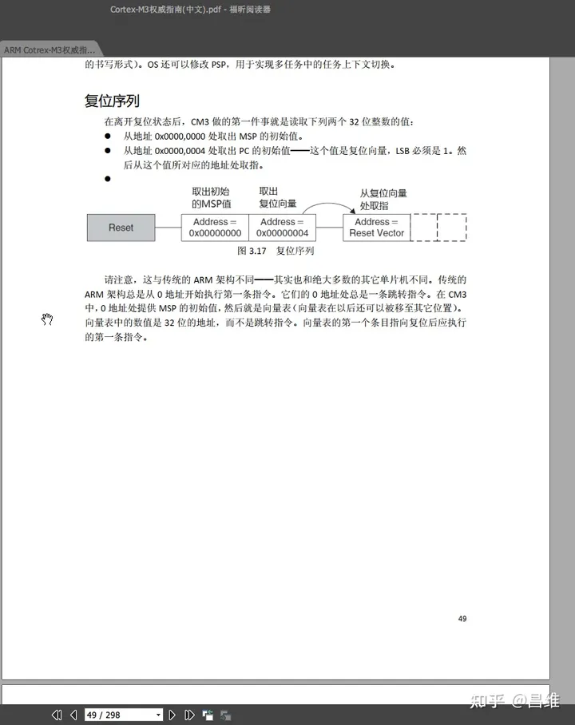
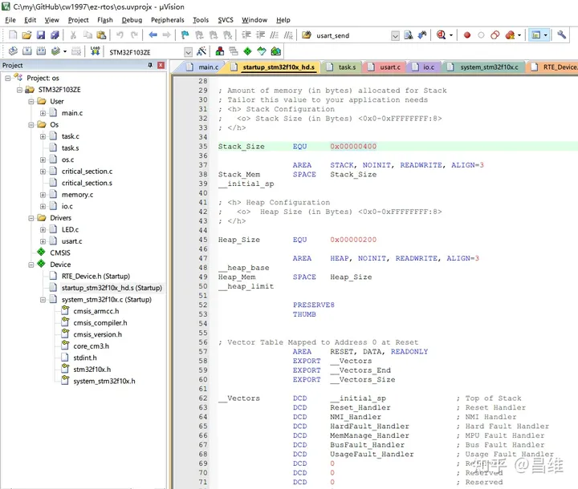
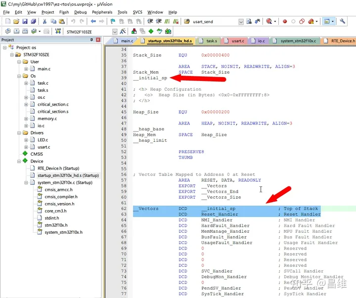
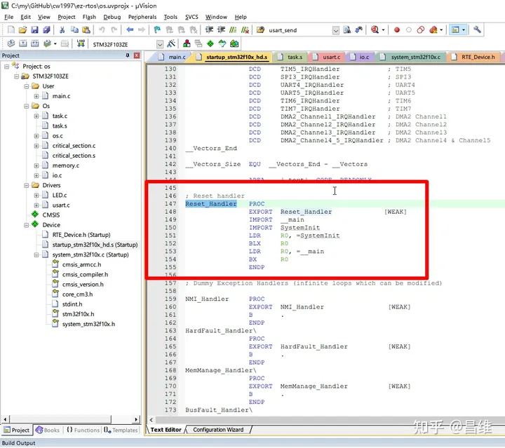
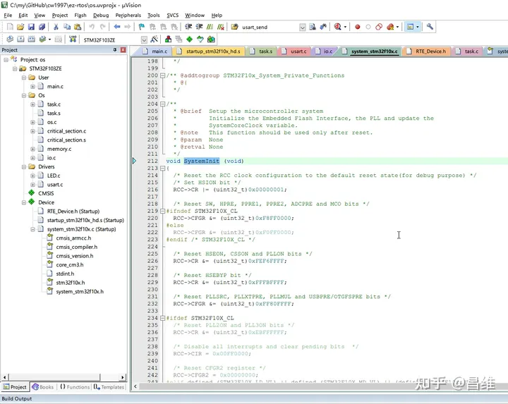
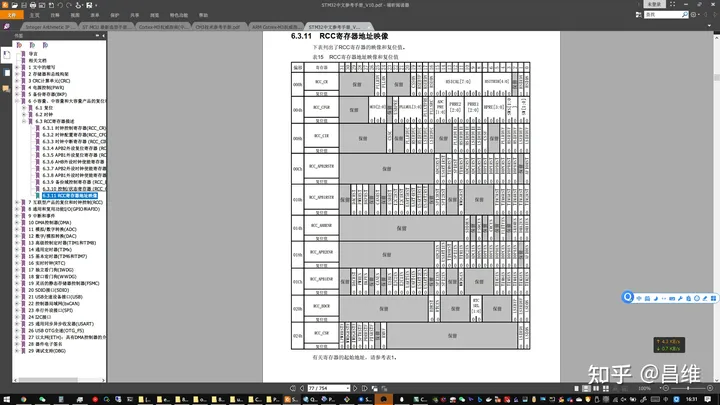
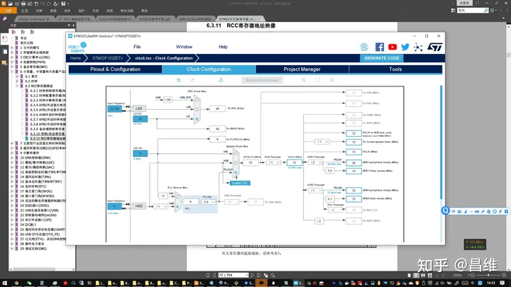
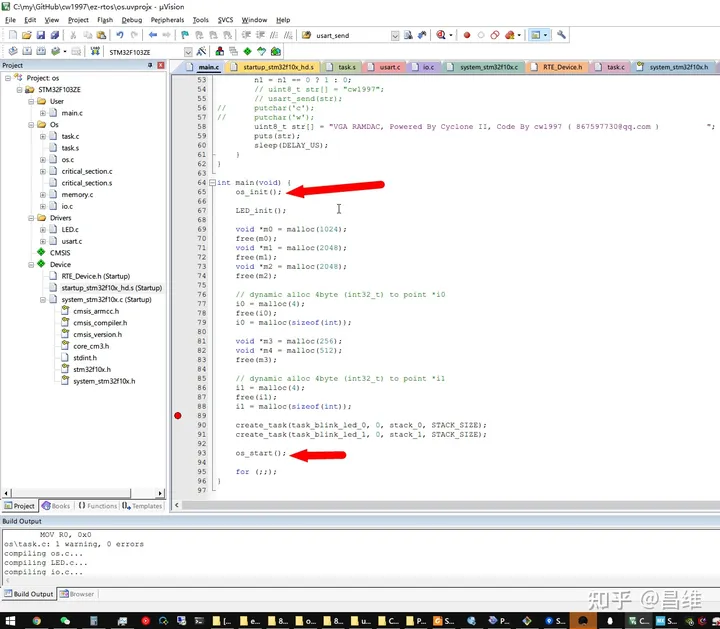
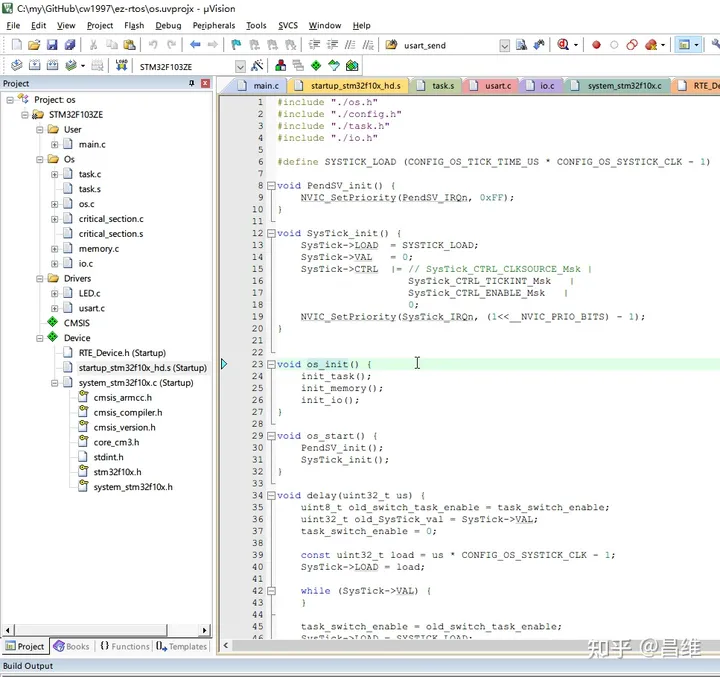

# 从零开始写一个操作系统（二） —— startup 与 bootloader

做任何事情都要有始有终，操作系统也不例外。

每个操作系统都应该会有一个 bootloader，它起到的作用就是初始化 CPU 之后开始执行操作系统。而初始化 CPU 本身的代码通常称为 startup。

因此有如下流程：CPU通电 -> startup -> bootloader -> 运行用户代码-> 关机断电

在单片机 CPU 通电以后应该做的第一件事情应该是是什么呢？或者说 startup 代码应该写什么呢？

翻到 《CM3权威指南中文版》的第 49 页给了我们答案



上电之后我们做的第一件事情应该是设置 stack 的位置，也就是栈顶指针，并且将它存放在 0x00000000 这个位置。然后 CPU 将会从 0x00000004 这个位置取出程序执行的起点内存地址，放在 PC 寄存器中。接着 CPU 就开始按照 PC 所指向的内存单元获取机器码指令并且开始按顺序执行下去了。

知道了这个规则，我们就可以着手开始写 startup了。

不过其实 ARM Cortex-M3 官方以及 ST 官方有为我们写好的 startup 代码，而且这个代码不仅仅做了上面两件事情，还设置了 heap 堆地址，生成了 NVIC 中断向量表。



具体可参考 startup_stm32f10x_hd.s 这个代码文件

请注意这个文件里面大量使用了“ARM伪指令”，伪指令类似于 C语言 中的 macro，它本身只是提供给编译器一些信息，例如define一个常量，声明内存分配区域，声明后续代码的字节对齐等等，而不会最终编译出真实的 ARM 机器码指令。

而伪指令中有一部分指令是起到分配内存空间的作用，例如 DCD 指令表示分配一段连续的字节区域，并且用指令后面的表达式作为这个字节区域的初始值，因此可以看到开头两个 DCD 命令分别将 stack point 和 Reset_Handler 填入了 0x00000000 和 0x00000004 这两个位置，这也和 CM3权威指南 中的说明一致。

stack point 的内存区域我们在前面已经看到了官方提供的地址是 0x00000400。那 Reset_Handler 呢？我们接着往下看



在 147 行我， 看到了这个函数的定义，我们发现其实 Reset_Handler 函数本质上也就是 reset 这个中断的 handler（处理函数），STM32 将上电后运行的 main 函数以及相关的初始化代码都视为一个中断的处理函数。



我们看到这里不仅仅 import 了 main 函数的入口地址，还 import 了一个叫做 SystemInit 的函数，并且先把 SystemInit 加载到 R0 寄存器然后 BLX 进去执行完了之后再去执行 main 函数的。为什么要在执行 main 函数之前执行 SystemInit 这个函数呢？他都做了什么？

## SystemInit() 做了什么
点击 SystemInit 这串字符串，然后按下键盘 F12 即可跳转进该函数的实现



我们会看到这里其实是 STM32 提供的函数了。

他通过对 RCC 寄存器进行设置。学过 STM32 的同学应该知道 RCC 寄存器是 STM32 的全局时钟树寄存器，定义了 STM32 内部的多个时钟频率为多少。

这就和我们在电脑上进入 BIOS 然后进行超频设置一样。

在《STM32参考手册》中可以看到更具体的寄存器定义与详情信息。



STM32CubeMX 这个由 ST 官方提供的工具也可以更加直观的查看全局时钟树的关联关系。



这里我们都直接使用 ST 官方默认的 SystemInit() 代码中的配置（和我上图STM32CubeMX中的配置一样）

剩下它还做了一些向量表地址等声明操作，有兴趣的同学也可以结合代码本身的注释看看。

做完这些操作以后才真正进入 main() 函数开始执行我们操作系统的代码了

因此我们再来看看 main() 函数都做了什么

## main() 做了什么？



这里 main() 函数首先执行了 os_init() 函数，然后后面执行了 LED_init() 函数用于初始化一些外设（device），分配了一些用户程序所需要的内存空间，通过 create_task() 创建了一些用户级任务，最后执行 os_start() 开始了真正的操作系统执行。

## 用户级与内核级
在上面我们提到了用户级代码这个概念，什么是用户级？

在 main() 函数中，除了 os_init 和 os_start 以外，其他都是用户级代码，也就是由用户自己写的代码，其余的都是操作系统本身提供的代码，页脚内核级代码。在工业级 OS 中，为了保证系统的安全性，通常会严格区分用户级和系统级代码。在 X86 的 CPU 上，甚至有独立的寄存器标识当前运行的程序级别（ring0 - ring3）。

我们这里为了方便起见暂时不做那么严格的等级区分。

## bootloader
初始化完 CPU 以后，我们还需要初始化操作系统的运行环境，例如我们的任务需要按照时间片轮询调度，我们就需要定义任务的切换时间间隔。我们还有内存管理器，因此我们还需要定义我们自己写的 malloc 函数是从哪个内存区域开始分配内存，生成内存分配链表等等，这些初始化的操作通常就是 bootloader 所做的事情。这些代码都在 os_init 和 os_start 函数中，这两个函数就组合成了 bootloader。



我们首先看看 os_init 阶段都做了什么事情。

可以看到 os_init() 的代码非常简短，就短短三行，而且含义也很明确，就是初始化 task 任务切换器，初始化 memory 内存管理器，初始化 io 接口。

```c
void os_init() {
    init_task();
    init_memory();
    init_io();
}
```

我们再看看 os_start 阶段又做了什么。

```c
void os_start() {
    PendSV_init();
    SysTick_init();
}
```

同样就短短两行代码。

但是这里可能就有点看不懂了，初始化了 PendSV 和 SysTick 这两个东西，这两个是什么呢？这就涉及到了任务切换器方面的设计了。我们在后面任务切换器章节将会详细介绍他们。

## 总结
看到这里，我们已经对 CPU 在上电以后做了什么，以及整个 OS 是怎么运行起来的有了一个基本认识，但是我们仅仅只知道他们调用了一些初始化函数，这些函数背后都做了什么事情，后面的章节我会更加详细的介绍他们。
