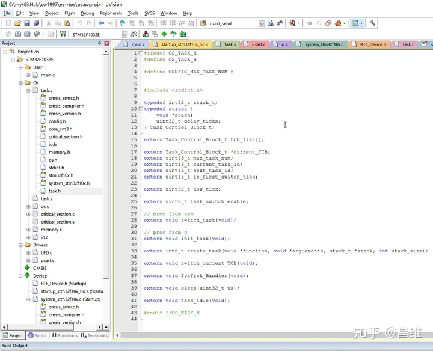
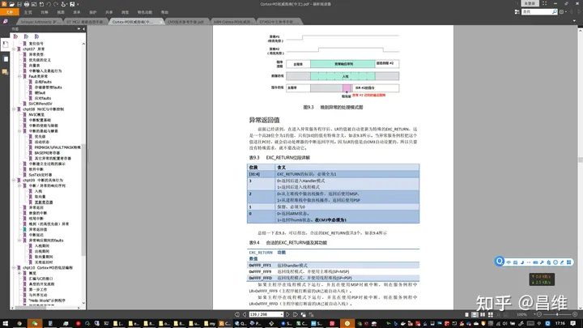

# 从零开始写一个操作系统（三） —— 任务切换器

在最开始的章节中我们编译了ez-rtos的项目工程源代码，只不过我们是在模拟器中跑的仿真，所以我们没办法在物理世界中看到真实的 LED 灯闪烁。如果有条件拥有 STM32 开发板的同学，可以将代码下载到开发板上看到如下的效果，你将会观察到两个 LED 灯以 DELAY_US 这个宏定义所定义的时间间隔进行交替闪烁。

本章节我们就将介绍怎么开发多任务操作系统中最基本的任务切换器功能，并且实现如下 LED 灯交替闪烁的功能。

通过ez-rtos的任务切换器实现LED灯交替闪烁

https://www.zhihu.com/zvideo/1343948512619311104

## CPU 能运行多个任务？
在学习计算机组成原理之前，似乎很多人觉得电脑能同时打开多个软件是一件理所当然的事情。然而并不是如此。

做过单片机开发的同学就知道单片机里面如果不引入操作系统，那么我们在 main() 函数中写的那些代码会从单片机通电后立即开始执行。那么问题来了，main() 函数只有一个，因此单片机的 CPU 通电以后只能执行 main() 函数这一个任务。

电脑CPU也是如此。熟悉 X86 OS开发的同学应该知道：电脑在上电以后会先执行 BIOS 中的上电自检程序检测所有硬件是否功能正常，然后再去 MBR 主引导扇区中读取 512 bytes 的 BootLoader，将其加载到 0x7c00 这个内存位置，并且 BIOS 将会从这个地方开始执行 OS 的 BootLoader。因此电脑在没有 OS 的情况下，也只能从 BootLoader 开始一直顺序执行下去。你可以认为 BootLoader 就是类似于单片机中的 main() 函数。

那么问题来了，只有一个 main() 函数，但是我又想让很多个任务（task）同时执行该怎么办呢？

答案就是引入多任务切换器，通过操作系统提供的多任务切换器，每隔一段时间就切换到下一个任务，只要保证每个任务都能每隔一个很短的时间就得到执行，那么我们就能够很逼真的感觉到这么多的任务仿佛在同时运行。

## 操作系统怎么切换任务？
请注意上一句话中的三处黑体字，它表明了我们的任务切换器应该要做上述三种操作。下面我们就来逐个剖析。

### 切换
任何 CPU 都有一个 PC 寄存器，这个寄存器指示着当前 CPU 正在执行内存中哪个地址上的指令。我们只需要修改 PC 寄存器就能过改变操作系统当前执行的指令。如果 CPU 此时此刻正在执行函数 A() 中的指令，我们将 PC 寄存器的值改成函数 B() 中的指令，那 CPU肯定会老老实实去执行 B 函数的指令了。

任务切换的思路我们已经有了。剩下就是“每隔一段时间”这个该怎么做的问题了。

### 每隔一段时间
STM32 以及主流的 CPU 都有提供定时器（Timer），定时器会在定时结束后发起一个时间中断，我们可以在这个中断中进行修改 PC 寄存器的任务切换操作。

### 下一个任务
现在还剩一个问题，就是我们的操作系统需要把 PC 修改为下一个任务的函数指针，那么去哪找到下一个任务并且获得它的函数指针呢？我们在 C语言中定义了那么多函数，究竟哪些属于需要被操作系统的任务切换器调度的任务？这就需要操作系统维护一个任务列表，操作系统因此就可以从这个任务列表中依次找到每个任务。这个列表通常叫做 tcb_list，后面会更具体介绍 tcb 这个单词的含义。

## 意外的降临
电脑不只是傻乎乎的运行事先存储在硬盘中的程序，他还需要根据外界提供给他的输入进行各种判断，然后提供合适的反馈。例如我们通过键盘打字，通过鼠标点击给计算机一些输入，然后计算机通过显示器和音响喇叭给我们一些反馈。

在单片机上，也会有许许多多的传感器，他们接受外界的环境信息，然后通过控制电机或者 LED 灯给我们用户反馈。

这就需要一种机制让 CPU 能够获取到外部的输入，然后针对不同的输入进行一些逻辑策略的判断，反馈输出。如果是刚学单片机的初学者可能很快就能想到写一个 while 循环不停的判断某个 GPIO 的电平高低来判断外界的输入到底是什么，然后循环体内再去写具体的函数判断逻辑，但是这就有一个问题，while 是一个死循环，CPU 得一直浪费时间执行这个死循环，没办法做其他事情。因此还有另一种手段，就是 CPU 提供的事件中断功能。

但是这个世界瞬息万变，事件中断的来临的时机我们无法预估，一旦有意外的事件来临，我们需要第一时间去处理这个事件中断，处理完了再让 CPU 判断是否到达了需要切换任务的时间点，若到了切换时间点则做我们任务切换的工作。（例如在医疗行业的心电监护仪，汽车中的安全气囊控制器，中断的响应优先级绝对是最高的，因为事关生命安全）。所以我们需要一种机制让任务切换的优先级低一点。

这在 Cortex-CM3 中有一个叫做 PendSV 中断就是专门做这个事情的。

SV 的全称是 Supervisor，指的是一些系统调用。PendSV 和普通 SV 的区别是它多了一个 pend，说明 PendSV 的事件处理函数可以被挂起，等到有合适的时机再去执行（也就是没有任何其他中断执行的情况下才会去执行它），因此通常 PendSV 的中断抢占优先级也被设为最低。抢占优先级最低意味着如果一旦出现其他中断来临，那么其他中断可以抢占 CPU 的使用权，优先执行完其他较为重要的中断处理以后再回来继续任务切换。

## 任务切换器的初始化
上面提到了任务切换需要有一个定时器实现定时切换任务，还需要维护一个任务列表，然后还需要利用 PendSV 将任务切换的函数作为一个低优先级的事件处理函数，那么任务切换器的初始化也就是做这些工作而已。

我们打开 ./os/task.c 和 ./os/task.s 以及它的头文件来详细学习一下代码该怎么写

通常阅读一个 C语言 项目，都是先阅读头文件看看它导出了哪些声明。



可以看到在代码顶部定义了最大可以执行的任务数量，我们这里为了简单起见设置为 8 个，如果你需要同时执行更多任务可以自行调大该值。

然后定义了 Task_Control_Block_t 这个结构体，这就是 TCB 任务控制块的全称，他记录了任务的一些执行信息，这里先暂时不用管里面的成员。

接着往后看，有一个成员类型为 TCB 的数组名为 tcb_list，这就是之前所说的任务列表了。

看到这里就好了，因为我们这一阶段主要了解任务管理的初始化操作。


我们看 init_task() 函数，首先调用 create_task 函数创建了一个 idle 任务，并且将 current_TCB 变量，也就是当前执行的任务的 TCB 设为我们创建的第一个 idle 任务，然后又内联了一段汇编代码，这个汇编代码将 PSP 的值设置为 0x00000000。

```c
#define STACK_IDLE_SIZE 32
stack_t stack_idle[STACK_IDLE_SIZE];
void init_task() {
    create_task(task_idle, 0, stack_idle, STACK_IDLE_SIZE);
    current_TCB = &tcb_list[0];
    __asm {
        // PSP = 0
        MOV R0, 0x0
        MSR PSP, R0
    }
}
```

为什么要做这几步操作呢？idle 这个任务是什么？为什么它是整个操作系统启动后第一个被创建的任务？

解释这个问题之前先讲个小故事：不知道大家有没有看过《编程之美》这本书？这本书的前言是一个多年在Microsoft 工作的招聘面试官收集了一些微软面试的经典题目。其中全书第一个题目就是问如何在任务管理器的性能窗口中，让 CPU 占用率的曲线为50%。当时微软的面试规则是允许使用搜索引擎来帮助解决问题，然而前来面试的那位同学尝试了很久，输入了很多关键词都没有任何思路。最后面试官给了她一个 hint：让 CPU 一半时间做事，一半时间什么都不做，候选人于是又开始搜索，怎么让CPU隔一段时间什么都不做呢？可是最后还是无计可施。面试官不得不无奈的拒绝了这位候选人。

是啊，问题就在于怎么让 CPU 什么都不做呢？CPU 通电以后什么都不做，那它到底又在做什么？这似乎是一个哲学问题？！


要让 CPU 的占用率为一个固定的值，首先就要明白 Windows 的任务管理器是如何计算 CPU 的占用率。

我们把任务管理器切换到进程这个标签页（在 Windows 10 中需要切换到详细信息这个标签页），我们会发现有个名称叫做 System Idle Process 的进程（在 Windows 10 中叫做系统空闲进程）


大家会发现你即使打开电脑后什么都不做，这个进程的占用率也非常高，这是怎么回事呢？

其实中文名字已经说的很清楚了，这就是 CPU 空闲时间的百分比，它的值加上 CPU 的占用率刚好等于 100%。

现在问题又来了，为什么 Windows 要启动这样一个进程？这个进程什么都不做，那启动它干嘛？

这就涉及到了 CPU 工作原理的一些知识了。CPU 的本质是一系列的同步时序逻辑电路，这些电路由一系列的晶体管组成，这些晶体管在通电以后，会被 clock 时钟信号（也就是主频）不停的驱动，根据流水线传入的机器码指令执行对应的翻转，输出计算结果。只要 clock 时钟信号不停止，晶体管就会一直被 clock 所驱动，这是一种物理规律，谁都无法改变。

因此理论上来说 CPU 内部的电路只要通电了，并且有时钟信号，就不存在什么事都不做这种情况，也可以理解为 CPU 内部的晶体管使用率永远是百分之百。这也就可以理解，为什么电脑开机后什么都不做，CPU 仍然会有一定的静态功耗（现代台式机CPU通常是几W，笔记本或者平板电脑的CPU可以低至几百甚至几十mW），而不是完全没有任何功耗。只是这个静态功耗相比他一直在做事（例如打游戏）的时候低很多。之所以这个功耗会变低是因为晶体管什么事情都不做的时候，只是维系着静态功耗，而不需要提供晶体管进行数字01翻转的动态功耗。（可以类比模拟电路这门课中提到单管放大电路需要一个直流电源提供静态工作点）

操作系统也是类似的情况，一个操作系统启动后 CPU 一定要做一件事情，不可能什么都不做，否则整个 CPU 就断电停机了。那么这件事情我们就可以定义为一个 idle 函数，这个函数只做一件事情，就是不停的将一个变量自增。


前面抛出了一个问题：任务管理器是怎么统计 CPU 的占用率的？答案就是在 idle 里面不停自增某个变量，然后在任务调度器里面也不停自增一个变量，对比 idle 的自增变量占任务调度器中全局自增的变量的比值，就是 CPU 的空闲时间比例，用 100% 减去这个 CPU 的空闲时间比例就得到了 CPU 的占用率。那么前面提到怎么让 CPU 什么事都不做呢？答案就是让任务调度器去调度 idle 这个任务，只要我们精确控制好调度 idle 的持续时间，也就精确控制了任务管理器中的 CPU 占用率曲线了。

至于怎么调度 idle， 这就涉及到了后面所提到的 sleep 函数以及怎么把任务挂起等一系列概念了。后面还会做详细讲解，这里花那么大篇幅就是为了解释为什么要引入 idle 任务这个概念。

最后回到正题，我们创建完 idle 再把它设置为当前任务这个很好理解，就是为了让操作系统任务列表的第一个任务为一个空闲任务，防止用户没有创建任何任务的情况下，操作系统也不会跑飞（PC寄存器能够不停的跑 idle 任务中的死循环，而不是跑到其他代码区，导致系统无法正常运行，甚至执行错误的指令，控制外接的电机发起了不可预料的危险控制操作）

最后我们还要设置 PSP 这个进程栈指针为 0，这一步是为了打一个标记，表示这是操作系统第一次调度任务，后续的任务切换器的核心代码需要知道是否是第一次开始调度任务，因为第一次调度任务和第二第三以及后面无数次调度都会有不一样的逻辑。

这就是整个任务的初始化阶段了。

前面我们创建 idle 任务有使用到一个名为 create_task 的函数，下面我们就来看看这个函数又做了什么？

## create_task() 函数做了什么？


```c
uint16_t create_task(void *function, void *arguements, stack_t *stack, int stack_size) {
    if (next_task_id > CONFIG_MAX_TASK_NUM) {
        return 0;
    }

    stack_t *stack_top = &stack[stack_size];
    // auto save by Cortex-M3
    *(--stack_top) = (stack_t)0x01000000u; // xPSR bit 24 = 1
    *(--stack_top) = (stack_t)function; // R15 PC function entry point
    *(--stack_top) = (stack_t)0x14141414u; // R14 LR
    *(--stack_top) = (stack_t)0x12121212u; // R12
    *(--stack_top) = (stack_t)0x03030303u; // R3
    *(--stack_top) = (stack_t)0x02020202u; // R2
    *(--stack_top) = (stack_t)0x01010101u; // R1
    *(--stack_top) = (stack_t)arguements; // R0
    // manual save by developer
    *(--stack_top) = (stack_t)0x11111111u; // R11
    *(--stack_top) = (stack_t)0x10101010u; // R10
    *(--stack_top) = (stack_t)0x09090909u; // R9
    *(--stack_top) = (stack_t)0x08080808u; // R8
    *(--stack_top) = (stack_t)0x07070707u; // R7
    *(--stack_top) = (stack_t)0x06060606u; // R6
    *(--stack_top) = (stack_t)0x05050505u; // R5
    *(--stack_top) = (stack_t)0x04040404u; // R4
    tcb_list[next_task_id].stack = stack_top;

    return next_task_id++;
}
```

话不多说，先看代码。

首先要判断当前已经创建的任务数量是否已经超过了最大的任务数量了，如果超过的话，就会导致存储任务列表的 tcb_list 数组发生越界，因此就直接返回0，不再执行后续操作。

如果一切正常，那么就创建该任务需要使用的栈段。但是这里栈段的初始化为什么是这样写的呢？这就涉及到了基本概念这一章节中所提到的指令集架构行为。这里先不做解释，我会先讲任务切换的流程，只有了解任务切换的流程，才能明白这里的代码为什么要这样写。

了解这些初始化栈段的流程之前首先需要了解一下一个任务在运行时会产生哪些上下文信息，以及这些上下文信息在遇到任务切换，中断请求的时候会被 Cortex-M3 CPU 做怎样的处理。

## Cortex-M3 双栈机制
任何函数在执行的时候都需要有自己的栈段，因为任何一个程序都由多个函数组成，并且都是从 main() 函数开始，依次调用，整个函数就像一条链子一样层层调用下去。由于函数存在嵌套调用的原因，因此需要栈这种数据结构来维护每个嵌套调用中的上下文信息（通常是调用之后的返回值，以及返回时需要恢复的寄存器信息）。

正常情况下通常只需要一个栈段就够了。但是 Cortex-M3 为特权级和用户级函数划分了两个栈段，通过 CONTROL寄存器进行切换，或者在使用 LR 指令返回的时候设置 第3个bit为1让中断处理程序返回到普通代码的时候切换所使用的栈段。


这两个堆栈名一个叫 MSP，另一个叫 PSP。

通常中断处理程序，内核级代码都会使用 MSP 栈段，而剩下的用户级代码则使用 PSP 栈段。

## 中断到来时会发生什么？
中断到来时，CPU 中的 NVIC 中断控制器会去查询中断向量表，找到该中断对应的处理程序（Handler），然后调用这个处理程序。这个和函数调用很像。但是区别是中断处理程序是内核级代码，它一定会使用 MSP 这个栈，并且可以执行特权级指令。


并且在进入中断处理程序之前会首先保存之前的上下文（寄存器）到其 SP 指针所指向的栈段（若进入中断处理程序之前正在执行操作系统的内核级代码，则 SP 会指向 MSP，否则 SP 指向 PSP）。毕竟进入中断处理程序也是一种特殊的函数调用，因此也要像普通函数一样保存上下文，以便处理完中断程序之后恢复之前执行的状态。

但是请仔细阅读 CM3权威指南 ，这其中提到了 CM3 的 CPU 内核只会自动保存 PSR，R0，R1，R2，R3，R12，LR（R15），PC（R15），其他寄存器并不会自动保存。原因是 AAPCS 规范（ARM架构过程调用标准AAPCS_进步源于记录，优秀来自分享-CSDN博客），这是 ARM 官方为 C语言的编译器设计的一套指导规范，这套规范可以保证C语言嵌套调用函数的时候不会破坏原有函数的信息。

## 将大象装进冰箱需要几步？
以前有一个小故事，问将大象装进冰箱需要几步？

答案是：打开冰箱门 -> 把大象塞进冰箱 -> 关闭冰箱门

同样，我们做任务切换也过是三步：保存上下文 -> 修改栈指针 -> 恢复上下文

请注意，我们在之前的文章中提到切换任务的本质是修改 PC 寄存器，为什么到这里没有这个步骤了呢？大家可以仔细想想。

。。。

原因就是 PC 寄存器本质上就是 R15 寄存器，它和其他的寄存器 R0 - R14 也同属于上下文的一部分，所以我们可以直接将整个上下文视为一个整体。

## 任务切换的步骤
我们前面花了很多时间讲解一些了解任务切换之前需要熟知的背景知识。如果你对这些知识还是感到很陌生迷茫，建议仔细阅读一下 CM3权威指南，《CSAPP》等教材加深理解。

下面开始真正讲解任务切换的步骤。

首先打开 ./os/task.s 这个文件，这个文件中的 PendSV_Handler 函数便是整个任务切换的核心代码。


```c
PendSV_Handler PROC    
    EXPORT PendSV_Handler
        
; turn off all interrupt
    CPSID I


; check PSP, if PSP == 0, this is the first task switch
; so we can skip 'save context' and 'select next TCB' step
    MRS R0, PSP
    ; if r0 == 0, jump to restore_context
    ; LDR R1, =is_first_switch_task
    CBZ R0, restore_context

save_context
    MRS R0, PSP
    STMDB R0!, {R4-R11}
    LDR R1, =current_TCB
    LDR R1, [R1]
    STR R0, [R1]

select_next_TCB
    PUSH {LR}
    BL switch_current_TCB
    POP {LR}

restore_context
    LDR R0, =current_TCB
    LDR R0, [R0]
    LDR R0, [R0]
    LDMIA R0!, {R4-R11}
    MSR PSP, R0
    ORR LR, LR, #0x4 ; R1 |= 0x04 : lr |= 32'b0000_0000_0000_0100

; turn on all interrupt
    CPSIE I

; return
    BX LR

    ENDP
```

这里贴出源代码，首先讲讲 ARM 汇编的格式。

ARM 的汇编指令（无论是真指令还是伪指令）必须要有一格缩进，可以是 tab 也可以是空格。能不带缩进的代码只有标号和注释等。

因此你可以看到所有没有缩进的代码除了注释以外都是标号，这些标号其实也都基本没有用到，只是解释下面的代码段所做的功能。

## 保存上下文
先看 PendSV_Handler 到 save_context 这两个标号之间的代码。

首先通过 EXPORT 伪指令导出了一个 标识符 PendSV_Handler，这个类似于 C语言中的 extern 关键词，这是为了告诉连接器遇到需要 PendSV_Handler 地址的时候直接从这里取地址。

然后使用 Cortex-M3 的 CPSID I 指令关闭了所有中断。因为任务切换涉及到修改栈段的操作，这一步不允许任何操作打断，否则可能会导致恢复或者保存的栈段不完整，甚至破坏请求打断操作的函数执行。

接着通过 MRS 指令读取特殊功能寄存器 PSP 的值。通过 CBZ 命令判断是否为 0。如果是 0 则直接跳转到 restore_context 标号下面的代码。

这里有人可能会问：为什么不直接用
```c
CBZ PSP , restore_context
```
来判断 PSP 是否为 0 呢？

这个其实和 Cortext-M3 的微架构设计有关，它的微架构在数字电路上的实现中没有设计能够直接通过 CBZ 判断特殊功能寄存器是否为 0 的逻辑电路，因此也就不支持这种方式。这就像 Intel X86 的 CPU 中有很多特殊功能寄存器都需要先 MOV 到 AX 这个寄存器之后才能做其他操作一样，这个属于硬件设计上的规范，我们必须遵守规范行事。

还记得前面我们 init_task 的时候设置了 PSP 的值为 0 吗？这一步就是为了这里的判断。如果是 0 说明整个 OS 是第一次做任务切换。

由于第一次做任务切换，所以说明到目前为止没有任何一个任务被执行过，因此也就不需要执行 save_context 这个保存上下文（保护现场）的操作，只需要恢复需要执行的第一个任务的上下文到寄存器中就好了。

然后如果 PSP 不是 0 的话说明之前已经进行过任务切换的操作了，则需要保存当前任务的上下文。也就是代码继续往下走。（从这里可以看出，ARM 汇编实现 C语言中的 if else 语句实际上就是使用类似于 CBZ 这种条件跳转指令）

我们接下来看 save_context 这个标号后面的代码是怎么保存上下文的。

```asm
save_context
    MRS R0, PSP
    STMDB R0!, {R4-R11}
    LDR R1, =current_TCB
    LDR R1, [R1]
    STR R0, [R1]
```

首先是 MRS 指令将 PSP 的值读入到 R0 寄存器中，然后通过 STMDB 指令将 R4-R11 寄存器的值全部都 push 进 R0 中。这里为什么是 R4-R11 而不是全部的寄存器呢？因为前面提到了 CM3 本身会自动保存一部分上下文，所以我们这里只需要保存剩余的上下文就好了。STMDB 指令是地址先减而后完成操作，因为 ARM Cortex-M3 中规定 stack 为满减栈，也就是往 CM3 的 stack 中 push 数据实际上栈顶地址是往下减少的。（可以搜索一下满减栈的概念解释）。

```c
typedef int32_t stack_t;
typedef struct {
    void *stack;
    uint32_t delay_ticks;
} Task_Control_Block_t;
```

然后将 current_TCB 这个变量的值读入 R1，由于 currentTCB 变量是一个指针变量，因此它的值仅仅是一个 TCB 结构体的内存地址。而这个结构体的第一个成员是一个 stack_t 类型的数组，我们还需要获得这个栈数组本身的地址，所以还需要一个 LDR R1, [R1] 指令将这个栈数组的地址读出来，并且存放到 R1 中。最后我们将之前满减压栈之后的新的栈顶地址存放到 R1 中，也就是修改结构体中 stack 成员的指针值。

总结一下：保存上下文阶段，我们先将 PSP 的栈顶读出，然后依次保存到当前任务的 TCB 中的 stack 指针指向的栈段数组中，并且修改栈顶位置（栈顶指针的值），然后保存到 TCB 中的 stack 指针的值。

## 选择下一个待执行的任务
先看代码

```asm
select_next_TCB
    PUSH {LR}
    BL switch_current_TCB
    POP {LR}
```

这里有一个 switch_current_TCB ，这是一个 C语言函数的指针，由于是直接通过汇编调用 C语言函数，因此我们需要手动保存 LR 寄存器，然后再用 BL 指令跳转过去。如果不使用 PUSH 保存 LR 寄存器，那么 C语言编译出来的汇编指令会直接覆盖我们整个 PendSV_Handler 中断处理函数的返回地址。然后最后在调用结束后我们还需要使用 POP LR 指令恢复之前保存的 LR 寄存器中的返回地址，确保 PendSV_Handler 中断处理函数在执行完任务切换操作以后能够正确的返回。

这里有调用 switch_current_TCB 这个 C语言函数， 因此我们还需要看看这个函数是怎么实现的。


```c
void switch_current_TCB() {
    if (current_task_id >= next_task_id - 1) {
        // check if not create any task, switch to idle task
        if (next_task_id >= 2) {
            current_task_id = 1;
        } else {
            current_task_id = 0;
            current_TCB = &tcb_list[0];
            return;
        }
    } else {
        ++current_task_id;
    }
    // check if a task is in delay
    // if all tasks are in waiting for delay
    current_TCB = &tcb_list[0];
    for (int i = current_task_id; i < next_task_id; ++i) {
        Task_Control_Block_t *checking_TCB = &tcb_list[i];
        // BUG!! now ticks is not update
        if (checking_TCB->delay_ticks == 0 || checking_TCB->delay_ticks <= now_tick) {
            checking_TCB->delay_ticks = 0;
            current_TCB = checking_TCB;
            current_task_id = i;
            return;
        }
    }
}
```

这个函数的逻辑会稍微复杂一点，主要是为了实现 sleep() 这个函数，所以增加了一些相关逻辑。我们只看重要的部分。剩余部分会在讲到 sleep() 函数实现的时候再回过头来看。

我们的 OS 应该要不停循环重复执行任务列表中的所有任务。那么最简单的写法就是判断当前切换的任务 id 是否已经超过了最大任务数量，如果超过的话就修改为 1，也就是从第一个任务开始执行，否则就任务 id 加 1，也就是选择下一个任务的 TCB 作为当前任务TCB 赋值给 current_TCB。请注意，这里提到了“如果超过的话就修改为 1”，为什么不是 0 呢？因为 0 号任务是 idle 任务，在正常情况下我们还需要判断当前的最大任务数量是否已经超过 1，如果超过 1 说明不止有 idle 任务，否则说明用户没有创建任何任务，整个任务列表里面只有 idle 这一个空闲任务。因此还需要多一些判断是否有用户的创建任务这个逻辑。这也就是

```c
if (current_task_id >= next_task_id - 1) {
    // check if not create any task, switch to idle task
    if (next_task_id >= 2) {
        current_task_id = 1;
    } else {
        current_task_id = 0;
        current_TCB = &tcb_list[0];
        return;
    }
} else {
    ++current_task_id;
}
```

这段代码所做的事情。

下面的代码涉及到“时基表”的一些功能逻辑，这是配合 sleep() 函数所需要用到的，我们后面才会提到，这里可以先暂且不看。

总结：经过上面的操作，我们已经将 current_TCB 这个指向当前任务 TCB 的指针修改为了下一个待执行任务的 TCB 指针。这也就告诉了后面负责恢复上下文的代码应该要从哪里恢复出上下文。

## 恢复上下文
恢复上下文这一个步骤才是真正做了任务切换，因为我们将新的任务的上下文中事先在栈段里面保存的 PC 值恢复到了 CPU 的 PC 寄存器中，因此这一步才是整个任务切换中至关重要的异步。

```asm
restore_context
    LDR R0, =current_TCB
    LDR R0, [R0]
    LDR R0, [R0]
    LDMIA R0!, {R4-R11}
    MSR PSP, R0
    ORR LR, LR, #0x4 ; R1 |= 0x04 : lr |= 32'b0000_0000_0000_0100
```

其实这一步和之前保存上下文的代码类似，先去读取 current_TCB 指针指向的 TCB 结构体地址，然后从这个地址中再取出 stack 这个指针类型的成员所指向的栈顶指针，并且 通过 MSR 指令赋值给 PSP 寄存器，也就是将 CPU 的任务栈段“偷梁换柱”替换成了新的任务的栈段。然后等到 PendSV_Handler 等会儿返回的时候，根据 Cortex-M3 自动从栈段中恢复 PC，LR，R0 - R3 的机制，就会自动将 PC 寄存器恢复成新任务的函数指针。这也就实现了任务切换。

不过细心的朋友会发现这里面有一个 ORR LR, LR, #0x4 指令，这是怎么回事呢？

这其实也和 Cortex-M3 的规范有关，这个指令集架构规定了当 LR 的第 2 个 bit（大端序，从右往左数，从 0 开始计算的话则是第 2 位）为 1 ，那么从中断处理函数返回的时候则会自动使用 PSP 作为返回以后使用的栈。




这个规则在 CM3 权威指南中文版的第 139 页均有说明。

请读者自行翻书查阅。（PDF 文档在基本概念这一章节中有提供百度网盘下载地址，或者自行网上搜索）

执行完“偷梁换柱”的替换栈指针操作以后，最后就是收尾工作了。

收尾工作的代码很简单

```asm
; turn on all interrupt
    CPSIE I

; return
    BX LR
```

就是启用全部中断（因为之前禁用过），然后使用 LR 寄存器返回即可。

更细心的朋友可能还发现在这段汇编代码后面还有一个 NOP 指令


大家都知道 NOP 指令是什么都不做的意思，既然什么都不做为什么还要执行它呢？这里其实是为了保证代码能够 4byte 对齐，这个是编译器的要求，你不对齐也没关系，只是编译器会报一个 warning 警告，不对齐会影响 CPU 取指令的效率等等，所以遇到这种 warning 还是尽可能加一下 NOP 这种指令对齐一下比较好。

## 总结
看完这里我们其实已经把整个任务切换的核心代码都过了一遍。但是还是有一个问题，我们都知道只要调用 PendSV_Handler 这个函数， OS 就会开始切换任务，但是从头到尾我们都没有看到一行代码主动调用了它。既然都没有调用它，那 OS 怎么还会自动定时切换呢？这就涉及到了 SysTick 以及 PendSV 这两个中断本身的一些特性了，这个我们会在下一个章节继续讲解。
