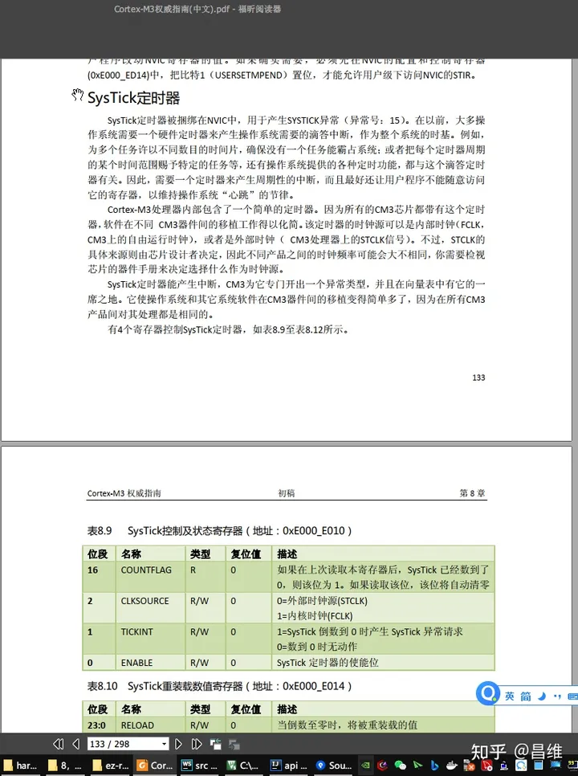
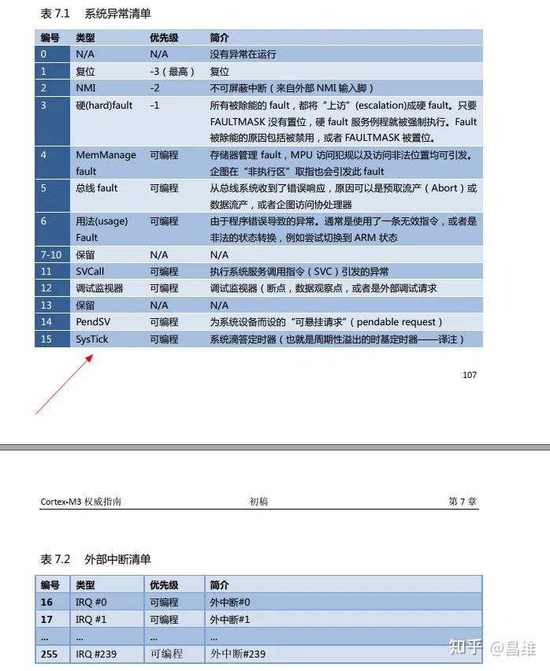
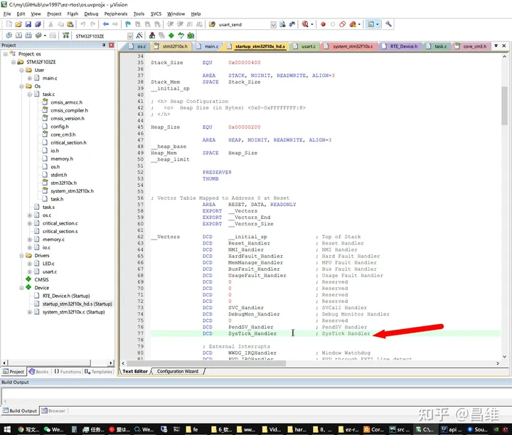
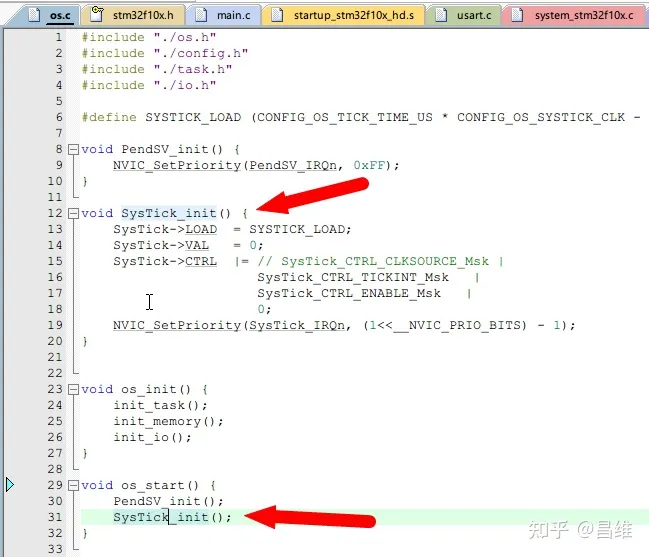
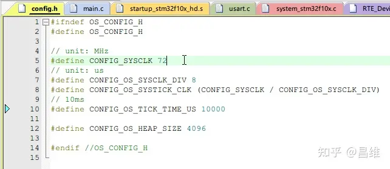
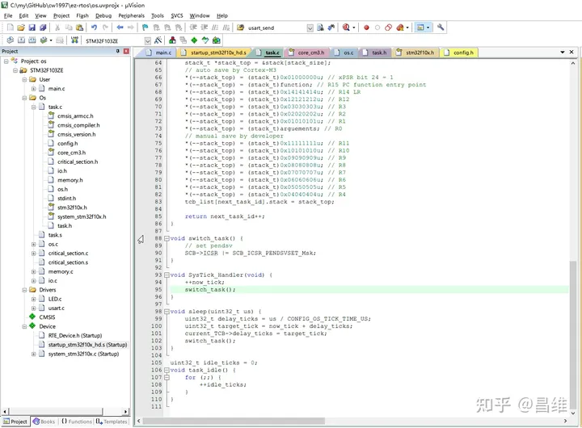
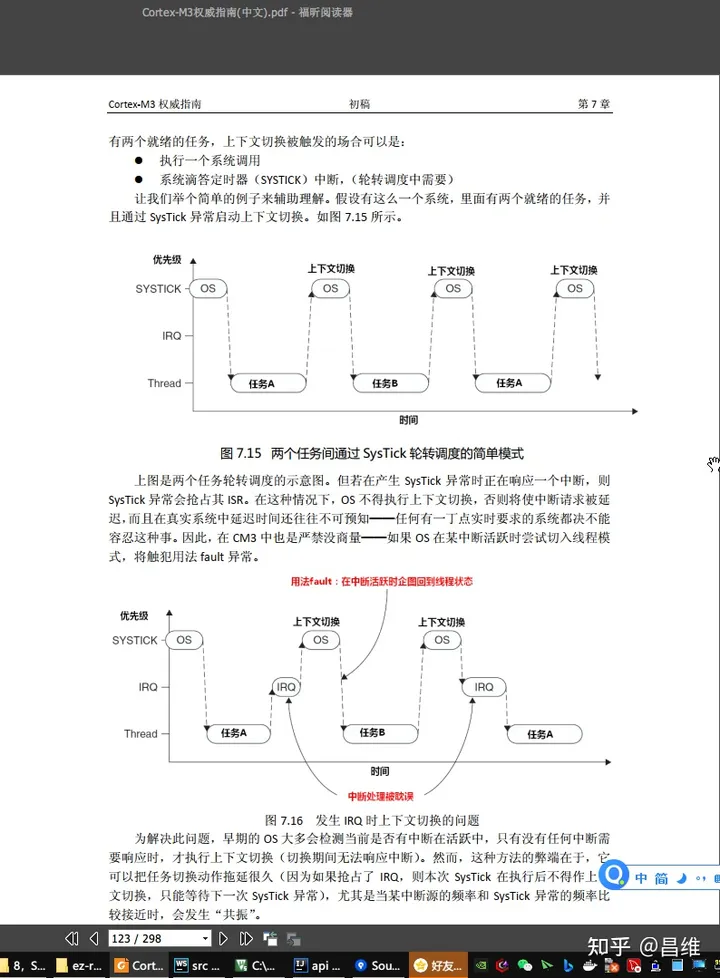
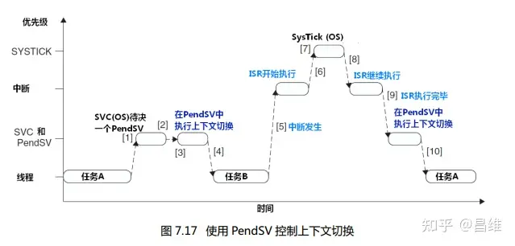

# 从零开始写一个操作系统（四） —— 任务切换的时机

在上一章中我们介绍了任务切换器的核心代码

我留下了一个很重要的问题：任务切换器本身是怎么被调用的？

因为我们即使看遍了整个 ez-rtos 的源代码，也并没有发现并没有什么地方显式调用了 PendSV_Handler 这个函数。

所以这个章节，我再详细介绍一下任务切换器是怎么被“定时”调用的。

## SysTick
要在 STM32 中实现定时执行某个任务，通常可以用 STM32 本身提供的 Timer 硬件定时器。

但是这里请注意一个问题：Timer 属于外设，它是单片机厂商自行添加的，而非 CPU 微架构提供的。而我们如果要写一款 OS 并且希望他能够尽可能在更多的单片机上运行，那么我们应该尽可能使用 CPU 内核提供的资源，而非单片机外设。

SysTick 就是 ARM 为 Cortex-M3 这款微架构提供的内核级硬件定时器。

所以为了实现定时切换，我们需要了解一下 CM3 内置的 SysTick 计数器。

查看 CM3 权威指南中文版第 133 页



这里对 SysTick 有更加详细的说明。

它其实和各种单片机的定时器使用差别不大。都是先往 Val 寄存器中填充一个预装载值，然后定时器便会按照指定的时钟频率对 Val 执行自减一操作（Val = Val - 1 操作），当 Val 被自减到 0 之后便会触发一个中断，然后 NVIC 便会去执行 NVIC 中断向量表中指定偏移的指针指向的那个中断处理函数。



至于为什么函数名是 SysTick_Handler 呢？这是因为在 startup 文件中官方默认就用的是这个标号作为这个中断处理函数入口指针的代名词，你如果想换成其他名字，只需要在 startup 以及其他相关文件中改一下就好了。



介绍了 SysTick 的基本概念后，我们具体看代码来了解一下怎么使用它。

将代码编辑器定位到 ./os/os.c 文件的第 12 行。



```c
void SysTick_init() {
    SysTick->LOAD  = SYSTICK_LOAD;
    SysTick->VAL   = 0;
    SysTick->CTRL  |= // SysTick_CTRL_CLKSOURCE_Msk |
                      SysTick_CTRL_TICKINT_Msk   |
                      SysTick_CTRL_ENABLE_Msk	|
                      0; 
    NVIC_SetPriority(SysTick_IRQn, (1<<__NVIC_PRIO_BITS) - 1);
}
```

这里初始化 SysTick 的各项寄存器，其中用到了一个 SYSTICK_LOAD 常量，他表示每次计数器都初始化为 SYSTICK_LOAD 这个值。因为前面已经提到了 SysTick 定时器是自减定时器。这个宏定义在代码上面有定义

```c
#define SYSTICK_LOAD (CONFIG_OS_TICK_TIME_US * CONFIG_OS_SYSTICK_CLK - 1)
```

它为系统配置的每个 tick 的时间片大小乘以 SysTick_CLK 系统时钟的大小减 1。这个公式需要结合单位来理解（学过高中物理的同学应该知道一个技巧，就是理解复杂公式之前首先看单位，先把单位运算过一遍，就知道每一个小部分公式计算出来的值是什么意义）。



CONFIG_OS_TICK_TIME_US 的单位是 us，表示每个时间片应该拥有多少个微秒，像 Windows 系统的时间片通常为 15ms 也就是 15,000 us。

CONFIG_OS_SYSTICK_CLK 的单位是 MHz，实际上 MHz 的单位在数字电路中还有一种理解方式是每秒多少百万个 edge（CPU 内核时钟每秒产生多少个上升沿或者下降沿），而对于同步时序数字电路来说一个 edge 也就是一个 tick，因此 CONFIG_OS_SYSTICK_CLK 这个常量的单位也就是 mega tick / s。

然后我们现在需要求解的问题是已知 mega tick / s 和 us，并且
$s（second） = 1000 * 1000 *  us（μ second）$
，求解一个时间片应该要拥有多少个 tick，那么推导公式如下：

$
MHz = \frac{1,000,000 \cdot tick}{1 \cdot s} = \frac{1,000,000 \cdot tick}{1,000,000 \cdot us} \Rightarrow tick = MHz \cdot us
$

而这里由于计算机是从 0 开始算起，因此还需要减去 1，这也就是上面那个常量表达式的推导过程。

然后 Ctrl 寄存器中设置了两个 bit 为 1，他们分别是使能（enable）和需要触发中断。（如果不触发中断，则我们需要用一个死循环去不停读取 SysTick->VAL 是否到了 0，这样很浪费CPU，但是在一些特种环境下为了节省中断请求产生的延迟，可能会用这种方案，这种方案在计算机编程中还有一个专业术语叫“自旋锁”，表示一直在死循环的几个指令中不停转圈圈并且“锁”住后面的代码段不被执行，除非解锁条件也就是 SysTick->VAL == 0 这个表达式成立）

后面 NVIC_SetPriority 表示设置 SysTick 的优先级，这个 NVIC_SetPriority 函数是 STM32 官方提供的，有兴趣的同学可以参照优先级寄存器的定义和官方代码结合理解。

这里设置最低抢占优先级和最高亚优先级。之所以这样设置是因为任务切换并不是一个高优先级操作，而对外部的响应应该要优先于任务切换操作，所以我们不希望任务切换操作抢占外部中断的响应。亚优先级的设置策略则需要结合 PendSV 的原理来理解。

好了，SysTick 的初始化我们已经做完了，那么我们只需要在 SysTick_Handler 这个函数中执行前面那段汇编代码，那么就会每隔一定的时间片后就执行任务切换的操作，岂不是我们就实现了定时切换？

没错，简单的 OS 都是这样做的，但是现有的工业级 OS，例如 FreeRTOS，uCOS 并不是这样做的，具体原因我们还需要了解一下 PendSV 的概念。

## PendSV
将代码定位到 ./os/task.c 的 void SysTick_Handler(void) 函数

```c
void switch_task() {
    // set pendsv
    SCB->ICSR |= SCB_ICSR_PENDSVSET_Msk;
}

void SysTick_Handler(void) {
    ++now_tick;
    switch_task();
}
```

我们会发现这里先是对 now_tick 这个值进行自增，然后调用了 switch_task() 函数，而 switch_task() 函数中也只是设置了一个寄存器的值为 1，并没有做其他操作，例如主动调用 PendSV_Handler 这个函数，那么任务切换函数又是怎么被调用的呢？



了解这个问题之前，首先又得了解一下系统调用和可悬起的系统调用这两个概念。

在工业级 OS 中，为了保证系统安全性，通常不允许用户级代码直接访问硬件资源，例如直接操作硬件寄存器或者修改 NVIC 中断向量表都是不被允许的。这种操作只能在内核级函数中执行。但是有的时候用户代码有确实需要调用硬件，这该怎么办呢？

OS 为了实现用户代码操作硬件，就事先讲一些操作硬件的代码封装成系统调用函数，通过中断的方式请求系统调用，系统调用进入内核级再去操作具体的硬件。由于系统调用是 OS 的开发者编写的，是经过验证和测试的，不会有什么危险操作。因此既满足了用户需要操作硬件的需求，又没有让用户代码直接去操作硬件。

但是有一个问题是：系统调用和其他普通的中断函数一样会抢占其他任务，如果我们为了保证外部中断能够及时得到响应，最好的办法是将系统调用的抢占优先级设置成最低，亚优先级也设置成最低。

在普通的系统调用中这样设置并没有什么问题。但是如果是 SysTick ，它只会在当 Val 被自减到 0 的时候才请求中断，为别的值的时候就会取消中断的请求。

因此当外部中断来临的周期和任务切换的定时周期相近的话，可能会导致每次 SysTick 的值刚刚快被自减到 0 的时候，外部中断来临了并且抢占了 SysTick 的中断，等外部中断处理函数执行完毕以后，SysTick 又重新装载了新的值（因为 SysTick 是内核级定时器，它永远都在不停的自动重装载 Load 寄存器和自减 Val 寄存器，除了时钟停止以外并不会因为任何状况停止计时），那么 SysTick 的中断就会被错过，因此任务切换的操作也就不会被执行。这个情况也称为“中断共振”，指的是两个中断的产生周期几乎一致。

相关的情况说明可以参考 CM3 权威指南中文版的第 123 页



为了解决这个问题，CM3 微架构专门引入了 PendSV 可悬起系统调用。你只需要设置 PendSV 的悬起位为 1，那么只要系统有空闲（这里的空闲指的是没有任何中断请求发生）的情况下就会执行 PendSV_Handler 函数。因此 SysTick 到点后只需要设置一下 PendSV 的悬起位，而不需要做实际的任务切换操作，而是先执行更高优先级的中断处理函数，执行完以后系统发现有空闲了，并且 PendSV 的悬起位为 1，才会去执行 PendSV 的中断处理函数。



设置 PendSV 的悬起位的代码如下

```c
void switch_task() {
    // set pendsv
    SCB->ICSR |= SCB_ICSR_PENDSVSET_Msk;
}
```

这些常量都是 CM3 的 startup 代码中有定义，读者可以自行将相关部分代码和手册中指定的寄存器地址对照查看。

## 题外话
学过 WEB 前端开发的同学可能知道 JavaScript 引擎中有事件循环（Event Loop）和微任务和宏任务的概念。其实这里的 PendSV 和微任务的策略就很相似，都是一旦系统有了执行时机就会立马去执行相关操作。JavaScript 引擎本身也是单线程执行，和单片机只有一个 CPU 是一样的，所以他们都需要类似的调度策略解决多个任务谁先谁后执行的问题。

## 总结
这一章我们彻底剖析了任务切换器是怎么被 CM3 的内核自动定时执行的，了解了 SysTick 和 PendSV 的概念。

细心的同学可能发现了 SysTick_Handler 中断处理函数除了调用 task_switch 函数把 PendSV 的悬起值设为 1 以外，还对一个 now_tick 变量执行了自增操作，为什么要执行这个操作？

有的同学可能会联想到之前我再介绍 idle 任务时提到计算 CPU 占用率的事情。但是其实我们这里并没有做统计 CPU 占用率的问题。

这个变量是为了实现任务切换器中的另外一个功能而准备的。这个功能叫 sleep()，也就是让某个任务暂停一段时间。我们需要这个变量配合实现时基列表的功能，因此这里需要对它自增。

至于操作系统里面的 sleep() 函数是怎么实现的，时基列表又是什么？我会在最近更新相关教程，敬请期待！
