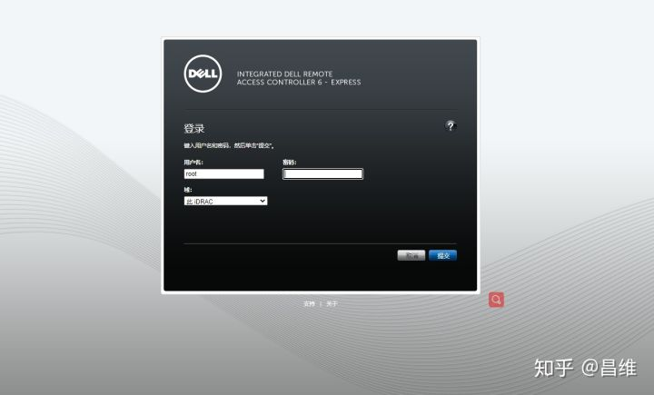
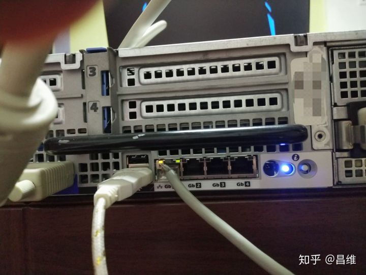
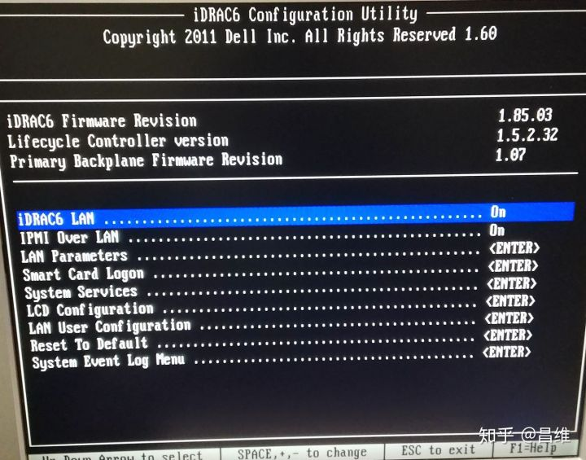
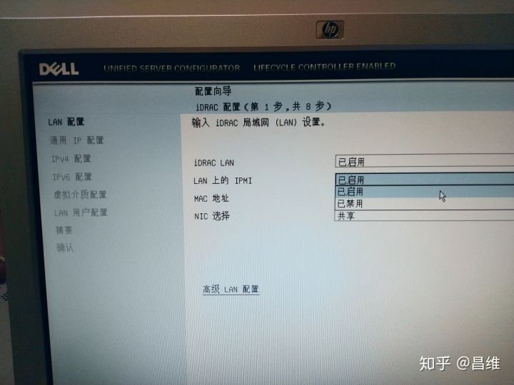
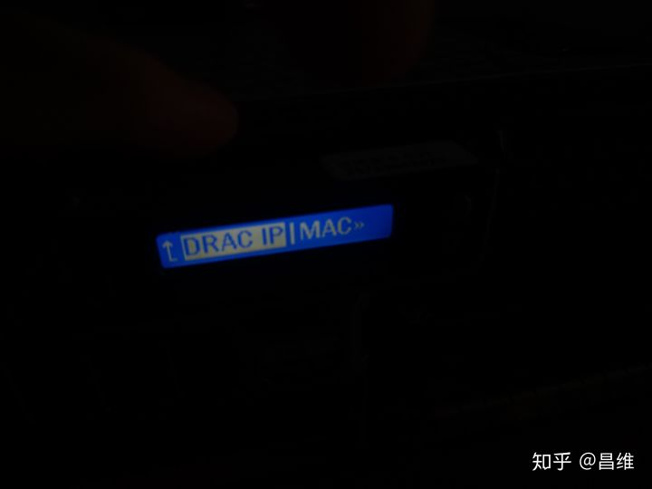
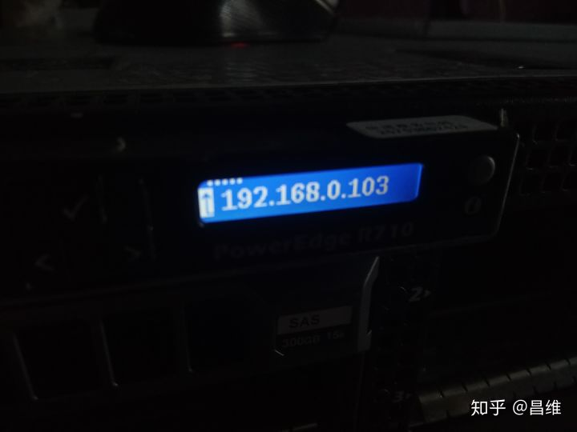
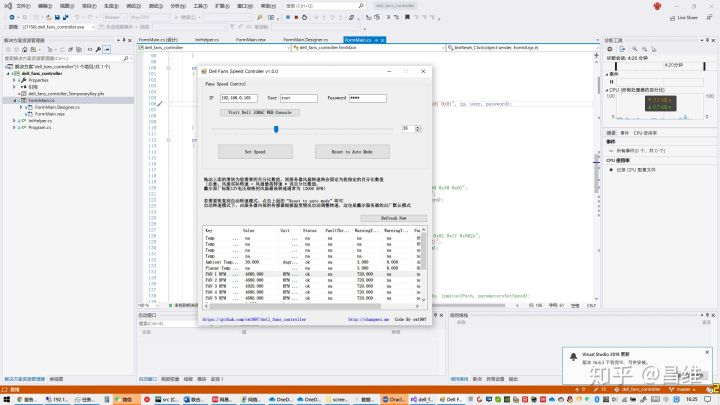

# 服务器的BMC，IPMI介绍以及Dell服务器风扇降速方法

家里搞台高性能的机架服务器做NAS或者跑一些服务，最大的问题莫过于风扇噪音了。

如果是家用PC，一般情况下风扇的控速功能是集成在BIOS里面。我们可以通过开机之后按Del或者F2进入BIOS设置程序中，对风扇转速等进行控制。

而服务器中通常是将该功能集成在BMC（Baseboard Management Controller，主板管理控制器）中。原因是BIOS代码需要交给CPU执行，需要7*24h不间断运行的服务器如果出现各种故障导致无法开机或者无法进行网络通信，那么我们就无法使用BIOS提供的各项功能。

因此诞生出了两种控制方式，**带外控制和带内控制**。

带内控制也就是控制器本身运行在主机的CPU上。例如Windows的RDP（3389），Linux的SSH（22），他们最大的优点是部署方便，零成本（因为是软件提供）。最大的缺点是一旦主机的网络出现问题或者主机掉电关机，我们将无法通过带内控制的方式让其开机（必须让运维人员到物理机房中手动开机）。

带外控制也就是控制器本身不运行在主机的CPU上，而是控制器自己自带一个小型CPU。例如机房的大型KVM切换器就是一台小型电脑，他通过物理接口对接了服务器主机的网卡，USB（鼠标键盘），PS/2（老式圆口鼠标键盘），VGA（视频显示器），主板开机键的跳线。使得我们可以在主机软件或者网络出现故障的情况下，直接用KVM对服务器进行控制。

BMC本身也是一个带外控制器，它相当于在服务器主板上另外又增加了一个非常小型的嵌入式计算机（类似于树莓派这种ARM架构的微型电脑）。这个小型嵌入式计算机本身也运行了一个操作系统，这个操作系统里面会执行各种服务，包括传感器（Sensor）的数据收集，通过特定总线与风扇转速控制器以及其他各种外设的监控器连接，他们还跑了一个HTTP Server，使得用户可以直接通过浏览器输入BMC的IP地址访问一个GUI图形化界面来观察服务器的运行指标。



戴尔服务器里面更进阶的iDRAC Enterprise企业版还具有IP KVM的功能，可以让运维人员坐在办公室就能够通过网络对服务器进行控制。

下面再来讲讲IPMI

IPMI是智能型平台管理接口（Intelligent Platform Management Interface）的缩写，是管理基于 Intel结构的企业系统中所使用的外围设备采用的一种工业标准，该标准由英特尔、惠普、NEC、美国戴尔电脑和SuperMicro等公司制定。用户可以利用IPMI监视服务器的物理健康特征，如温度、电压、风扇工作状态、电源状态等。而且更为重要的是IPMI是一个开放的免费标准，用户无需为使用该标准而支付额外的费用。

[https://www.intel.com/content/www/us/en/products/docs/servers/ipmi/ipmi-home.htmlwww.intel.com/content/www/us/en/products/docs/servers/ipmi/ipmi-home.html](https://link.zhihu.com/?target=https%3A//www.intel.com/content/www/us/en/products/docs/servers/ipmi/ipmi-home.html)

**IPMI是一种标准规范，BMC是实现这个标准规范的控制器硬件本体。**

看完上面的介绍，我们就知道BIOS里面通常是无法调整风扇转速的，我们要通过IPMI的信道去发送调整风扇转速的指令。

IPMI信道可以通过网络进行通信，所以首先我们要接入一根网线在IPMI所在的LAN 1网口（戴尔服务器是LAN 1号网口，别的服务器需要根据说明书确认插在哪个网口）



接入完之后，我们要在BIOS设置界面中开启IPMI的网络通信功能。



或者在戴尔的生命周期管理器中开启



如图所示IPMI Over LAN设置为On即可

然后下面有设置用户名和密码的地方，请注意这里密码虽然可以设置为空密码，然后保存设置，但是实际上空密码是无法登录的。

iDRAC6 LAN开启后可以通过WEB界面的方式查看风扇转速和主板环境温度（非南北桥和CPU温度）

开启之后我们还要设置它的IP，通常情况下如果是DHCP那么就需要去路由器的管理界面查看或者开机的时候会有显示，如果来不及观察，也可以通过前面板的LCD显示屏查看



进入View后选择DRAC IP，然后根据实际网络情况选择是IPv4还是IPv6



然后记下这个IP


接着，有个开源工具叫做ipmitool能够帮助我们与IPMI的BMC设备通信。

[https://github.com/ipmitool/ipmitoolgithub.com/ipmitool/ipmitool](https://link.zhihu.com/?target=https%3A//github.com/ipmitool/ipmitool)

在这个github仓库的release中我们可以下载到它的可执行文件

[Releases · ipmitool/ipmitoolgithub.com/ipmitool/ipmitool/releases](https://link.zhihu.com/?target=https%3A//github.com/ipmitool/ipmitool/releases)

具体指令如下（把IP，username和password换成你自己的）

首先需要关闭风扇的根据温度自动控速的功能，否则会出现调节风扇转速之后过几秒钟又恢复原状的情况。

```text
ipmitool.exe -I lanplus -H ip -U username -P password raw 0x30 0x30 0x01 0x00
```

然后设置转速，注意这里设置的值是一个百分比，通常是最高转速的百分比，对于标准的12V原厂戴尔风扇，这个转速最高能达到12K RPM转，标准的2U机架服务器，六个风扇达到这个转速的噪音犹如飞机起飞。但是也不能调的过低，防止过热影响硬件工作，请注意谨慎调节。

```text
ipmitool.exe -I lanplus -H ip -U username -P password raw 0x30 0x30 0x02 0xff 0x转速的百分比的16进制
```

对转速进行调节即可

如果要恢复温度自动控速的功能，则执行

```text
ipmitool.exe -I lanplus -H ip -U username -P password raw 0x30 0x30 0x01 0x01
```

即可

由于这样操作很麻烦，我用C# WinForm写了一个GUI小工具，可以输入IP，帐号密码后直接进行转速调节，以及查看调节后的转速情况。

[https://github.com/cw1997/dell_fans_controllergithub.com/cw1997/dell_fans_controller](https://link.zhihu.com/?target=https%3A//github.com/cw1997/dell_fans_controller)

运行之后在文本框正确输入IP，用户名和密码，然后点击下方的Refresh Now即可立即刷新Sensor传感器信息的列表，查看当前的风扇转速和温度情况。如果要修改温度，拖动滑块到指定位置，然后按下Set Speed按钮即可。如果要恢复自动转速模式，点击右边的Reset to Auto Mode按钮即可。

**通常建议室温在30度的情况下，最少要达到2500RPM的转速，才能正常保证双路TDP为95W的CPU在load为25%以下的情况下能够正常工作，如果CPU平均load为50%以上的情况下不建议手动降速了，否则可能有影响硬件寿命的风险。**




如果要下载EXE可执行文件可以直接在github release中下载

https://github.com/cw1997/dell_fans_controller/releases


下载地址

https://github.com/cw1997/dell_fans_controller/releases/download/v1.0.0/dell_fans_controller_v1.0.0.zip


有任何问题欢迎提issue或者直接在本文下方评论区留言。
