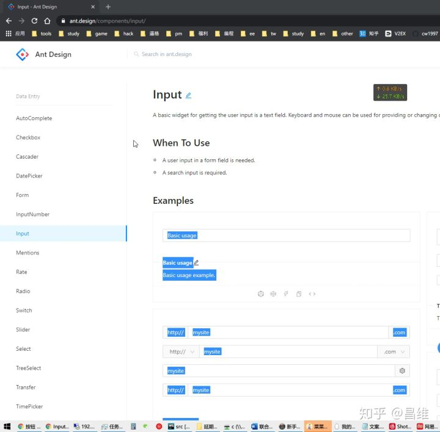
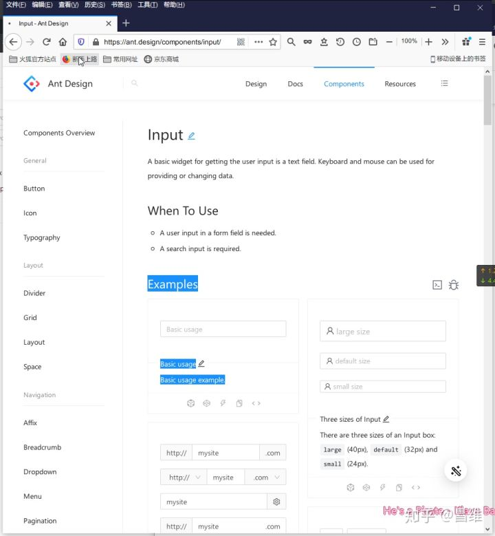
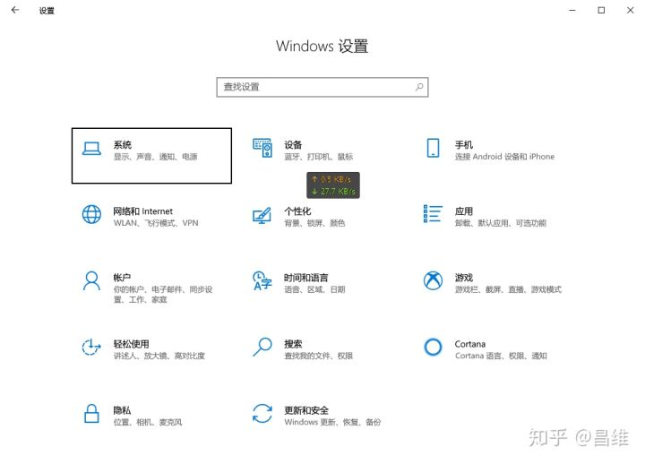
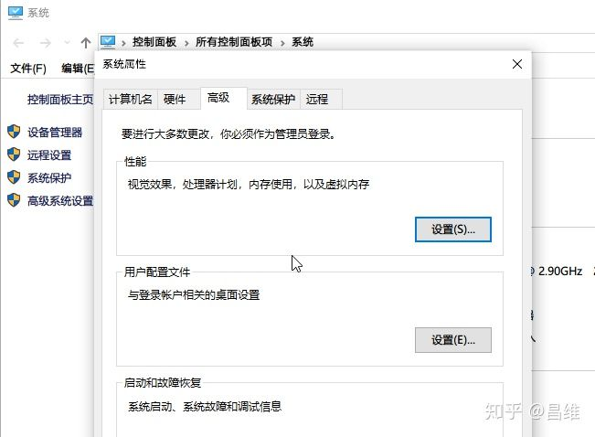
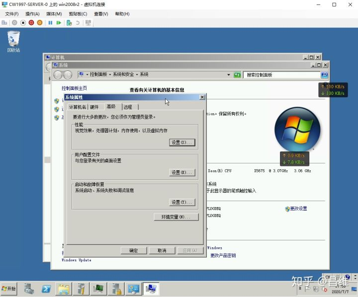
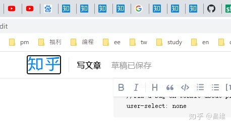
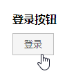
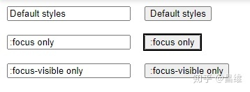
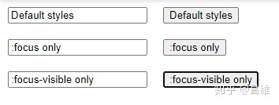

# 前端开发中的placeholder与focus细节

## placeholder

这是input和textarea标签的一个属性，用于在文本框内无任何文字时显示一个灰色的提示文字。他能够提示用户在文本框中正确输入内容。

通常这个文字的User-Agent样式（浏览器默认样式）的color属性（文字颜色）是灰色的，但是如果自己设计UI组件，通常会对字体颜色有另外一套定义方案，则这个颜色需要修改为正文字体颜色的较低一个档次（越低越偏白色），防止placeholder内容与input的value内容无法分辨，影响使用。

目前最新CSS没有将placeholder纳入标准属性，因此需要使用带有浏览器内核厂商的属性来修改该样式。

Chrome，Edge，国产浏览器极速模式等webkit内核下使用

```text
::-webkit-input-placeholder
```

Firefox使用

```text
:-moz-placeholder
```

请注意他们的区别，webkit不是常规的单冒号标识伪类，而是双冒号。双冒号表示这是一个“伪元素”，单冒号表示这是一个“伪类”。双冒号才是真正规范的写法。

当然从外观上来看通常没什么问题。但是如果你仔细操作，会发现Webkit内核下，placeholder内容在文本框内确实无法选中，但是如果从文本框外选择是可以被选中的，这不是一个很好的设计，例如通常情况下我们需要从网页中复制大段文字到Word或者其他文字排版工具里面，会误将这些placeholder复制过去，影响用户体验。



我们同样可以借助上面的“伪元素”::-webkit-input-placeholder 将这个feature禁用

```text
&::-webkit-input-placeholder
  //fix a bug on webkit about placeholder can be selected
  user-select: none
```

相比之下Firefox则显得友好许多，默认情况下就已经禁止选中了。



------

## &:focus

focus，焦点。在GUI图形用户界面中，他表示目前可以通过键盘进行交互的控件。在Windows上通常表现为一个黑色或者蓝色的实线（solid line）





而在旧版本中通常表现为一个黑色阴影或者虚线



细心观察的同学可能发现了在两个月前Google Chrome的更新中，将原本outline-color为蓝色的焦点样式改为了黑色。



看起来确实丑了一点。但是如果是无法使用鼠标的极端环境，或者残障人士通过语音等设备进行交互，那么这个焦点将会提供极大的帮助。例如纯键盘环境下我们可以通过Tab键进行切换控件焦点。

当然并不代表使用鼠标的情况下就不需要focus样式了，例如文本框仍然需要焦点样式，否则我们无法确认现在按下键盘之后，文字将会输入到哪。

通常在前端开发中，我们使用

```text
:focus
```

这个伪类样式来实现

但是大部分情况下我们都用鼠标操作计算机，我们希望能够在鼠标操作的情况下，按钮button等控件在点击之后不显示这个focus样式，而在通过键盘Tab操作的情况下才显示。这种操作，这样就尽可能保证了Accessible，但是又使得正常用户能够获得比较好的视觉美观效果。

这种行为我们自己给它定义一个名称叫做：启发式焦点显示

但是请注意，这个“启发式焦点显示”的行为在Chrome下很奇怪：如果你是直接使用button标签以及User-Agent样式（浏览器原生默认样式），没有对button标签的样式做任何覆盖和重写，那么上述“启发式焦点显示”的表现是默认存在的。但是如果你准备自己实现一个CSS框架中的按钮样式，例如antd的Button组件，那么你会发现这个“启发式焦点显示”的表现特性消失了。


上图为Chrome 83的情况，自己覆盖button标签的原生样式之后，点击按钮后会出现一个突兀的黑色outline，影响美观

因此需要你自己去实现。那么该怎么实现呢？

[https://drafts.csswg.org/selectors-4/#the-focus-visible-pseudodrafts.csswg.org/selectors-4/#the-focus-visible-pseudo](https://link.zhihu.com/?target=https%3A//drafts.csswg.org/selectors-4/%23the-focus-visible-pseudo)

css的[Selectors Level 4](https://link.zhihu.com/?target=https%3A//drafts.csswg.org/selectors-4/%23the-focus-visible-pseudo)规范中提供了

```text
:focus-visible
```

伪类替代原始的:focus伪类来解决这个问题



使用:focus-visible替代:focus，点击按钮之后没有突兀的焦点样式，保证视觉美观

:focus-visible目前在Firefox 78中是默认支持的，而在Chrome版本（2020年7月 Version 83.0.4103.116 (Official Build) (64-bit)）中仍然为实验性支持功能，也就是说需要在

[chrome://flags/#enable-experimental-web-platform-features](https://link.zhihu.com/?target=chrome%3A//flags/%23enable-experimental-web-platform-features)

中开启才可以体验。而默认情况下这个特性是Disabled状态。所以为了使得默认情况下也能使用，需要使用WICG/focus-visible这个polyfill（兼容脚本）

[WICG/focus-visible](https://github.com/WICG/focus-visible)

观察如下Demo即可

源代码如下[[1\]](https://zhuanlan.zhihu.com/p/157576861#ref_1)

```html
<html>
<head>
    <style>
        input, button {
            margin: 10px;
        }

        .focus-only:focus {
            outline: 2px solid black;
        }

        .focus-visible-only:focus-visible {
            outline: 4px dashed darkorange;
        }
    </style>
</head>
<body>
<input value="Default styles"/>
<button>Default styles</button>
<br/>
<input class="focus-only" value=":focus only"/>
<button class="focus-only">:focus only</button>
<br/>
<input class="focus-visible-only" value=":focus-visible only"/>
<button class="focus-visible-only">:focus-visible only</button>
</body>
</html>
```

效果如下



鼠标点击:focus only按钮时，按钮会出现一个比较明显且突兀的outline，虽然能够很明显看出当前的焦点按钮是哪个，但是却极大影响界面美观


鼠标点击:focus-visible only按钮之后，周边没有较为突兀的outline




使用键盘的Tab键切换焦点至:focus-visible only按钮之后，按钮周边仍然会出现较为明显的outline，提示用户该按钮为当前的焦点控件，意味着用户在此时按下Enter回车键等效于直接用鼠标点击该按钮


建议以后在新项目中都尽可能使用较为明显的focus样式，但是通过:focus-visible这个伪类来使得常规操作情况下不显示这个比较明显却突兀的焦点样式。
