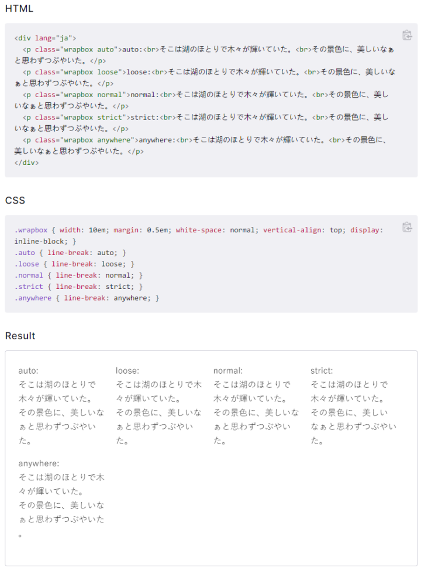

# 全角标点符号在 Web 网页中的排版问题

我在 [PingCAP](https://pingcap.com) 担任前端开发实习生，实习工作中遇到一个全角标点符号在 HTML 中的排版问题，特此分享。

收到同事反馈，天才计划 https://tidb.io/talent-plan 页面的 introduction 部分文字的第一行溢出。

编辑切换为居中

天才计划 https://tidb.io/talent-plan 页面的 introduction 部分文字的第一行溢出

我的思路第一是在 Chrome 鼠标右键点击该段文字，点击 inspect，在 Chrome DevTools 的 Element 选项卡中排查该元素的布局情况，但是没有发现任何问题。

后来询问另一位资历更深的同事后得知是全角标点符号在 HTML 中有着特殊的排版规则。

该规则很简单：当浏览器渲染引擎渲染一段包含 CJK 字符和全角标点符号的文字时，若一个全角标点符号是某一行的第一个字符，则当样式 line-break: auto; 存在时，该全角标点符号将携带它的前一个字符共同换行到新的一行，防止全角标点符号出现在一行的第一个字符位置处。

但是你可以通过设置 line-break 为其他值，修改该换行规则。具体参考 [line-break - CSS: Cascading Style Sheets | MDN](https://developer.mozilla.org/en-US/docs/Web/CSS/line-break) 

至此，以上问题的原因已查明。

实际情况并非第一行文字溢出，而是下面两行文字都出现了全角标点符号可能在第一行的情况，导致下面两行文字的最后一个字符都跟随其后的全角标点符号一起换行到了下面，使得上面出现两个空缺。导致看起来像是第一行文字溢出了。

这种 feature 属于全角标点符号文字的排版规范，这种规范的存在可能会使得某些情况下排版布局有问题。想要解决这种问题，要么建议产品经理修改文案，使用别的表述方式绕过这个问题；要么修改文字容器的宽度，尽可能在标准窗口宽度下不出现这种情况。如果以上方法都无法妥协，则只能使用 line-break 修改换行规则，强制要求浏览器在排满一行文字后才允许换行。
